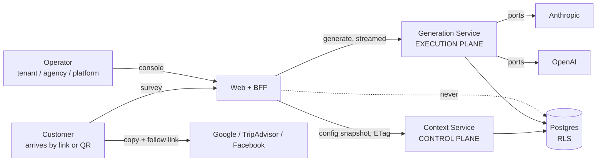
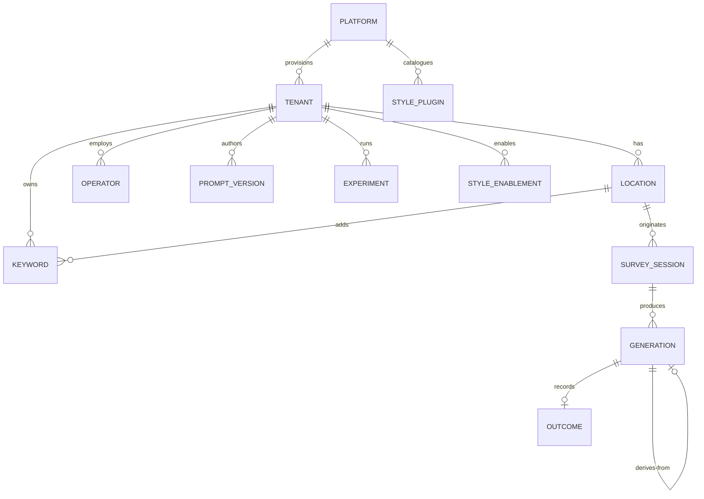
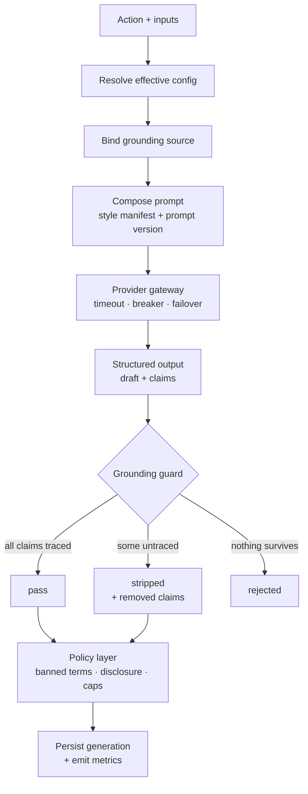

# 01 · System design

**Status: historical design sketch.** The canonical domain language/invariants are in
`docs/agents/domain.md`, package decisions are in accepted ADRs, the accepted student assessment/deployment
architecture is in `docs/SYSTEM-ARCHITECTURE.md`, and the accepted delivery plan is in
`stories/EPICS.md`. This file remains
useful as source context but is not authoritative when those artifacts disagree with it.

---

## 1. Constraints that shape everything

| # | Constraint | Consequence |
|---|---|---|
| C1 | The product may not fabricate reviews (FTC 2024 rule; Google/Yelp/Meta ToS) | A grounding guard sits on the output path of **every** action. Non-negotiable, non-bypassable. |
| C2 | It may never publish on a customer's behalf | No outbound write integration exists anywhere in the system. |
| C3 | Tenants share infrastructure | Isolation must be enforced below the application, not by discipline. |
| C4 | Generation costs real money per call | Cost is a first-class domain value, not a log line. |
| C5 | Model calls take 5–60 s and stream | The execution plane cannot sit behind a 29 s gateway. |
| C6 | Config changes are rare, generation is frequent | Config must be a cached snapshot on the hot path, never a live read. |
| C7 | Agents write most of the code | Architectural rules must be executable, not documented. |

---

## 2. System context



The dotted line is load-bearing: **the BFF never touches the database.** It is enforced by a
fitness function, not by convention.

---

## 3. Configuration model — three scopes

Every configurable value belongs to exactly one scope. This is the backbone of the whole system.

| Scope | Owner | Examples |
|---|---|---|
| **Platform** | the vendor | provider registry & credentials, price table, style catalogue, default policy template, global limits, feature flags |
| **Tenant** | a business account | identity, locale, tone, banned terms, keyword taxonomy, enabled styles, enabled actions, disclosure & verification policy, draft cap, budget, prompts, experiments |
| **Location** | one physical venue | address, entry mode, platform destinations & place ids, keyword additions, policy overrides |

### Effective configuration resolution

```
effective(field) = location.overrides[field]
                ?? tenant[field]
                ?? platform.defaults[field]
```

Resolution is a **pure function in the domain package** with its own test suite. Two rules make it
honest:

- **Overrides store only what changed.** Reset deletes the override; it does not copy the parent value
  down. A later tenant change therefore still propagates.
- **The resolved snapshot records provenance** — for each field, which scope supplied it. The console
  renders that as a scope badge; the operator always sees the blast radius of an edit.

---

## 4. Domain model



### Invariants (each becomes a test)

| # | Invariant |
|---|---|
| I1 | Every claim in a stored generation traces to an asserted keyword, a span of customer text, or a recorded instruction. Nothing else is persistable. |
| I2 | A derived generation's claim set is a **subset** of its source's claim set. Restyle, Condense and Expand cannot grow it. |
| I3 | A generation is fully reproducible from its id: context version + prompt hash + style version + provider + model + params. |
| I4 | No row is readable outside a tenant session. Enforced by RLS, not by query construction. |
| I5 | A prompt version is immutable. Editing produces a new content hash. |
| I6 | An experiment variant assignment is stable for a given session id for the life of the experiment. |
| I7 | Cost is recorded against the price row in effect at generation time; superseded rows are retained. |

---

## 5. The generation pipeline — one pipeline, seven actions

The seven actions are **not seven code paths**. They are one pipeline with different input bindings
and different grounding predicates.



### Grounding source per action

| Action | Grounding source | Predicate |
|---|---|---|
| Generate | asserted keyword ids + free text | `claim ⊆ assertions` |
| Paraphrase | the customer's own text | `claim ⊆ spans(sourceText)` |
| Regenerate | inherited from the origin action | as origin |
| Restyle | the source generation's claims | `claims' ⊆ claims` |
| Condense | same | `claims' ⊆ claims` |
| Expand | same | `claims' ⊆ claims` — **expansion adds words, not facts** |
| Refine | source claims ∪ {instruction} | `claims' ⊆ claims ∪ {instruction}` |

Availability is gated twice: `tenant.enabledActions ∩ style.supportedActions`. Both are data.

---

## 6. Service decomposition

```
Context Service    CONTROL PLANE.  Owns configuration across all three scopes.
                   NEVER calls a model. Emits versioned config snapshots.

Generation Service EXECUTION PLANE. Owns composition, the provider gateway, the grounding
                   guard, generation records and metric emission.
                   NEVER writes configuration. Receives config as an INPUT.

Web + BFF          Orchestration, session, link resolution, response shaping.
                   NEVER touches the database.
```

**The mechanism that makes the boundary real:** `GenerationRequest` carries a
`ResolvedConfigSnapshot` as a parameter. The execution plane cannot fetch config because it has no
credentials and no code path to do so. The boundary is a type signature plus a Postgres grant.

### Package graph

```
domain      ← pure. no I/O. composition, grounding, policy, resolution, bucketing, cost, edit distance
contracts   ← zod DTOs, the wire format, derived from the prototype FIXTURES
llm         ← provider port, adapters, FakeProvider, breaker, price table
plugins     ← manifest schema, loader, contract test kit
db          ← prisma, migrations, RLS, tenant-context client
observability ← EMF emitter, structured logger

domain imports NOTHING from the others. Enforced in CI.
```

---

## 7. Tenancy & isolation — four layers

| Layer | Mechanism | Stops |
|---|---|---|
| 1 · Routing | tenant + location resolved from the link path, never from a query parameter or a body field | parameter tampering |
| 2 · Session | operator's tenant bound server-side at authentication; console scope selection validated against role | privilege escalation via the UI |
| 3 · Row | Postgres RLS on every `tenant_id`-bearing table; `SET LOCAL app.tenant_id` per transaction | a missing `WHERE` clause |
| 4 · Grant | separate `context_svc` / `generation_svc` roles with disjoint grants | a service reaching outside its plane |

Layers 3 and 4 are the ones a reviewer will test. Both are covered by their own test suites (TS-06).

**Model chosen: pool** (shared database, shared schema, `tenant_id` + RLS). Rejected: schema-per-tenant
(migration cost at this scale), database-per-tenant (connection economics). **Migration trigger:** a
tenant requiring data residency, or exceeding ~100 GB — at which point the RLS boundary makes
extraction mechanical.

---

## 8. Data model

```sql
-- PLATFORM
platform_settings(id, default_policy jsonb, rate_limits jsonb, flags jsonb, log_retention_days)
providers(id, models jsonb, capabilities jsonb, status, is_default, is_fallback)
price_table(id, provider, model, per_m_input_micros, per_m_output_micros, effective_from)
style_plugins(id, plugin_key, version, manifest jsonb, target_platform, locale, status)

-- TENANT  (all RLS)
tenants(id, slug, name, locale, category, plan, monthly_budget_micros, alert_threshold_pct)
tenant_settings(tenant_id PK, policy jsonb, tone_guidelines, banned_terms text[], context_version)
keyword_categories(id, tenant_id, key, label, sort_order)         -- was an enum. see §12
keywords(id, tenant_id, location_id NULL, category_id, label, polarity, is_active, sort_order)
operators(id, tenant_id NULL, email, role, password_hash)         -- NULL tenant = platform_admin
style_enablement(tenant_id, plugin_key, enabled, sort_order, allowed_actions text[])
prompt_versions(id, tenant_id NULL, key, action, version_hash, body, created_at)   -- IMMUTABLE
experiments(id, tenant_id, action, status, variants jsonb, started_at, stopped_at)

-- LOCATION  (all RLS)
locations(id, tenant_id, slug, name, address, entry_mode, destinations jsonb, overrides jsonb, is_active)
visit_tokens(id, tenant_id, location_id, token_hash, issued_at, expires_at, consumed_at)

-- EXECUTION  (all RLS, generation_svc role)
survey_sessions(id, tenant_id, location_id, public_token, table_ref, created_at, expires_at)
generations(id, tenant_id, location_id, session_id, action, source_generation_id NULL,
            idempotency_key, style_key, style_version, prompt_version_hash, context_version,
            experiment_id NULL, variant_key NULL, provider, model, fallback_used,
            input_keyword_ids jsonb, input_free_text, source_text NULL,
            output_draft, output_claims jsonb, removed_claims jsonb, grounding_verdict,
            latency_ms, input_tokens, output_tokens, cost_micros, price_table_id, created_at)
generation_outcomes(generation_id PK, outcome, submitted_text NULL, edit_distance NULL, created_at)
usage_daily(tenant_id, location_id, day, action, generations, accepted, cost_micros)
```

`claims` shape: `[{ text, sourceKeywordId | null, sourceSpan | null }]`. Both null ⇒ unsupported ⇒ stripped.

---

## 9. API surface

```
PUBLIC (survey)
  GET  /s/:tenantSlug/:locationSlug?v=&t=   SSR entry; resolves scopes, validates token, opens session
  POST /api/generate                        { action, styleKeys[], assertions | sourceText | sourceGenerationId,
                                              instruction?, idempotencyKey } → SSE stream
  POST /api/outcome                         { generationId, outcome, submittedText? }

CONSOLE (authenticated, scope-checked)
  /admin/*                                  server actions over the three scopes

INTERNAL (Lambda Function URLs, IAM-signed)
  GET  /context/:tenantId/:locationId       → ResolvedConfigSnapshot (ETag)
  POST /generate                            → streamed GenerateResult
```

`/api/generate` is the only place all four gates meet: rate limit → budget → action availability →
grounding. Ordering matters and is tested.

---

## 10. Deployment topology (AWS, student-budget variant)

| Component | Choice | Because | Migration trigger |
|---|---|---|---|
| Web + BFF | Amplify Hosting | fastest AWS-native Next.js CD; free tier | custom VPC needs |
| Context Service | Lambda + Function URL | near-zero traffic, cacheable, free at idle | p99 > 1 s ⇒ provisioned concurrency |
| Generation Service | Lambda + Function URL, **response streaming** | 5–60 s calls; Function URLs have no 29 s cap; still zero idle cost | sustained > 5 rps ⇒ Fargate for warm provider connections |
| Postgres | Neon / Aurora Serverless v2 @ 0 ACU | scale-to-zero; brief permits a non-RDS host behind an AWS-centric topology | ship Terraform for the RDS `t4g` production variant too |
| Secrets | SSM Parameter Store SecureString | free; rotation is YAGNI here | rotation requirement ⇒ Secrets Manager |
| Metrics | CloudWatch EMF, 7-day retention | high-cardinality per-tenant dimensions, near-free from Lambda | cross-service latency attribution ⇒ OTel + X-Ray |
| CI/CD | GitHub Actions → OIDC | no long-lived keys | — |

**Refused in writing:** Kubernetes, service mesh, Kafka, API Gateway, Secrets Manager, ECS, Aurora
provisioned, multi-region. Each with a cost or complexity number.

---

## 11. Failure model — the degradation ladder

The system degrades in defined steps rather than failing:

```
1. primary provider slow      → timeout, retry with jitter
2. primary provider failing   → circuit opens, failover to secondary, fallback_used=true
3. all providers failing      → provider-error state, retry offered
4. tenant over budget         → 429; survey offers the unaided write-and-copy box
5. session over rate limit    → 429 + Retry-After; countdown shown
6. grounding strips all claims→ rejected; customer invited to add detail, input retained
7. config unavailable         → last good snapshot served from cache (ETag), staleness logged
```

Step 4 is the interesting one: **the product still works without the model.** A customer can always
write and copy a review. That is the difference between a degradation and an outage.

---

## 12. Observability

One EMF metric line per generation, dimensioned by
`{tenantId, locationSlug, action, styleKey, variantKey, provider, groundingVerdict}` with values
`{latencyMs, costMicros, inputTokens, outputTokens}`.

Product metrics, which matter more than the infrastructure ones:

| Metric | Why |
|---|---|
| **acceptance rate** | did the customer use what we wrote |
| **edit distance** (normalised, draft → submitted) | *how much they had to rewrite us* — the real quality signal |
| **grounding strip rate** per prompt version | a prompt that invents facts is a bad prompt, measurably |
| **cost per accepted review** | the unit the business actually buys |

Customer free text and draft content are **redacted from logs**. They are user content.

---

## 13. What the second tenant forced to change

Recorded here because it is the honest part of the design.

The keyword `category` began as a Postgres enum: `service | staff | ambience | value | speed`. A
dental practice and a Hamburg restaurant cannot share one enum — the restaurant needs
`essen · service · atmosphäre · preis · wartezeit`. The enum became `keyword_categories`, a
tenant-owned table.

Style manifests likewise gained `targetPlatform` and `locale`, and `description`/`sample` became
locale maps, because a manifest at `locale: "any"` cannot carry one language's copy.

Neither change was foreseen. Both were forced by making the second tenant structurally different
instead of cosmetically different. This belongs in `SPEC.md` as validated learning.

---

## 14. Open questions — settle these with the harness before coding

These are genuine forks. `02-ARCHITECTURE-DIALOGUE.md` contains the prompts to resolve each.

| # | Question | Default if undecided |
|---|---|---|
| Q1 | Does the grounding guard call a second model, or is it deterministic string/span matching over the structured `claims[]`? | Deterministic. A guard that can hallucinate is not a guard. |
| Q2 | Is the config snapshot cached in the BFF, in the execution plane, or both? | BFF only, ETag'd. One cache is debuggable; two are not. |
| Q3 | Do the two services share one Postgres with role separation, or two databases? | One, with disjoint grants. Two doubles the ops cost for the same isolation. |
| Q4 | Is `visit_token` single-use enforced by a `consumed_at` write, or by session state? | `consumed_at`, uniquely constrained. Session state is client-influenced. |
| Q5 | Does Regenerate create a new generation row or a new version of one? | New row with `source_generation_id`. Lineage is the audit story. |
| Q6 | Where does the experiment bucketing happen — BFF or execution plane? | BFF. The execution plane must stay ignorant of experiment config. |
| Q7 | Is the streaming response the draft text, or draft + claims + verdict? | Text streams; claims and verdict arrive in a terminal event. Grounding cannot run mid-stream. |

Q7 is the sharpest: **the grounding guard cannot evaluate a partial output**, so the stream is
provisional until the terminal event. The prototype's streaming UI already implies this. Decide
explicitly whether streamed text is shown before it has been grounded — and if it is, what happens
visually when a claim is then stripped.
