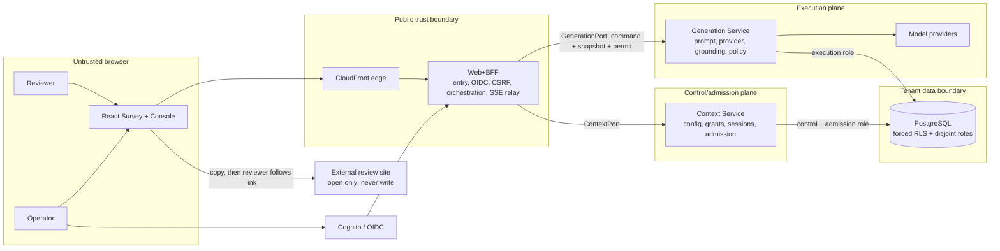
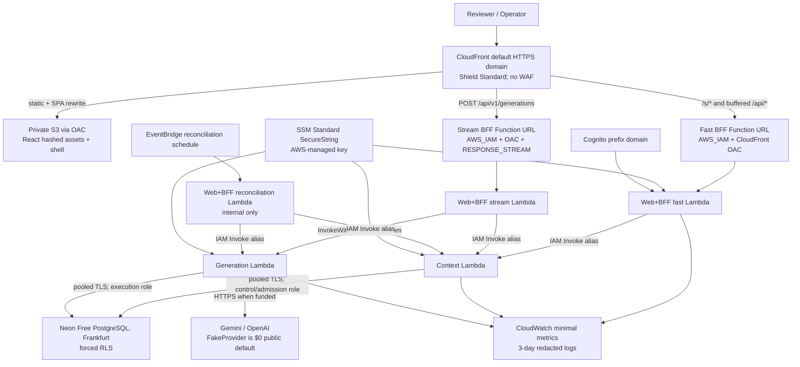

# Assisted review writing: student assessment architecture

- **Status:** Accepted for implementation on 2026-08-17; D0 assignment-source evidence remains missing
- **Date:** 2026-08-16
- **Intended to supersede after acceptance:** `01-SYSTEM-DESIGN.md` §§6, 9-12 and the topology assumptions in TS-15, TS-16, TS-17, TS-20 and TS-21
- **Does not supersede:** `docs/agents/domain.md` or accepted ADRs

This is the one architecture document for turning the interaction prototypes into an assessment-quality
system with a production upgrade path. It describes the intended system, not the current implementation.
`stories/EPICS.md` is the delivery plan and traceability map.

## 1. Decision frame

### Fixed by accepted repository decisions

| Constraint | Architectural consequence |
|---|---|
| Claims use only reviewer-confirmed Assertions or narrowly permitted verified context facts; typed system annotations are separate; the product never publishes | Every candidate is buffered, grounded and policy-checked before any Draft text reaches the browser. The terminal action is copy plus an outbound link. |
| Three configuration scopes: Platform, Tenant and Location | Context owns resolution and emits an immutable Effective Configuration Snapshot with per-field provenance. |
| Three deployables | `web-bff`, `context-service` and `generation-service` remain the only logical deployables. |
| Five shared packages | `domain`, `contracts`, `llm`, `db` and `observability`; Review Formats are versioned data, not executable plugins. |
| Domain has zero I/O | All database, network, filesystem, clock and provider behavior stays behind application-owned adapters. |
| BFF never imports DB | The BFF orchestrates only through its `ContextPort` and `GenerationPort`. |
| Generation cannot acquire configuration | Every execution receives the complete snapshot as an argument; its IAM role, DB role and imports provide no configuration-reading path. |
| Tenant isolation is a security invariant | Forced PostgreSQL RLS, composite tenant identities, disjoint DB roles, scope-aware cache keys and generic public errors are all required. |
| Node 24, pnpm, TypeScript and Nx | Keep the existing workspace and verification gate. Do not introduce another build system. |

The original assignment brief is not present in the repository. Claims that the assignment mandates two
live providers, executable plugins, experiments, Amplify, Function URLs or a second unused Terraform
stack are therefore unverified until D0 is resolved.

### Current implementation gap

| Repository evidence | Why it is not production behavior |
|---|---|
| `apps/web-bff/src/app.ts` serves `Survey.dc.html`, `Admin.dc.html` and `Gallery.dc.html` directly | The prototype fixture store, query-state harness and simulated authorization become the runtime. There is no production frontend. |
| `apps/web-bff/src/static-files.ts` reads `prototypes/` with `node:fs` per request | The deployment depends on source files and the process working directory instead of a versioned frontend artifact. |
| `/api/generate` accepts client-supplied Tenant/Location ids and fabricates a successful Draft on any exception | Admission, isolation, provider failure and grounding can all be bypassed. This fallback is test/development behavior only. |
| Student Terraform exposes Context and Generation Function URLs with `authorization_type = "NONE"`, a 30-second Generation timeout and Node 20 | Internal services are public, 60-second calls cannot complete, and runtime evidence disagrees with the workspace. It also omits the BFF and database. |
| Student Terraform labels a $10 AWS Budget notification a “hard limit” and provisions Anthropic/OpenAI placeholders | AWS Budgets do not stop spend, and the selected provider pair is now OpenAI/Gemini. Dummy secrets and an unimplemented provider must not look deployable. |
| The deployment workflow prints success while deploy and smoke commands are commented out | It is not deployment or rollback evidence. |
| The existing rate limiter is pure in-memory logic and is not called by a deployable | It cannot enforce a limit across concurrent Lambda environments. |

## 2. Product surfaces and frontend choice

### Production routes

| Surface | Route | Purpose |
|---|---|---|
| Reviewer link | `/s/:tenantSlug/:locationSlug?...` | BFF-only GET. Prepare a short-lived Entry Challenge and redirect cleanly; do not consume an Invitation Token on a crawler/prefetchable GET. |
| Reviewer start | `/start/:entryChallengeHandle` | React entry/rating screen. An explicit same-origin POST consumes the Invitation Token and creates the Review Session atomically. |
| Reviewer application | `/review/:reviewSessionHandle` | Mobile-first React application. The non-secret handle selects one Review Session only when paired with the browser capability cookie. |
| Operator console | `/console/*` | Authenticated React application for authorized Platform/Tenant/Location operations. |
| BFF API | `/api/v1/*` | Same-origin JSON and SSE. It is the browser's only service API. |
| Development gallery | `/__dev/gallery` | Visual/state fixtures in non-production builds only. |

`Index.dc.html`, `Gallery.dc.html`, `?state=`, `?tenant=`, latency/failure query controls and the shared
`localStorage` fixture are development tools, not authorization, routing or persistence mechanisms.
`MarketingPage.dc.html` is unrelated to the product and is not in scope.

### Selected frontend stack

| Concern | Choice | Reason |
|---|---|---|
| UI | React + TypeScript, built with Vite | The Survey and Console are interaction-heavy applications. They need no server rendering, and static hashed assets keep the public path fast and cheap. |
| Routing | React Router | One bundle supports `/review/:reviewSessionHandle` and lazy-loaded `/console/*`; route guards improve UX but never replace server authorization. |
| Workflow state | A pure typed `transition(state, event)` statechart local to the frontend | The prototype has 20 Survey states and failure/retry/cancel paths. An explicit transition table is testable without adding a state-machine framework. |
| Server state | TanStack Query | Owns request lifecycle, cancellation, retry policy and ETag revalidation. It does not cache Review Sessions across users. |
| Forms/contracts | React Hook Form plus Zod schemas from `packages/contracts` at wire boundaries | Operator configuration needs field-level validation and optimistic concurrency without copying domain rules into components. |
| Localization | `react-i18next` resource bundles plus browser `Intl` | `en-GB` and `de-DE` are configuration-selected; no Tenant branches appear in component code. |
| Styling | Existing Maue tokens converted to CSS variables and local React primitives; CSS Modules for composition | Preserves the prototype's visual language without shipping its runtime or creating a shared UI package with only one consumer. |
| Tests | Vitest + Testing Library + axe for components; Playwright for journeys | Tests observable UI behavior, keyboard/focus behavior and real browser/API integration. |

Keep both artifacts in the existing `apps/web-bff` Nx project: `src/frontend` builds a browser-only
bundle to `dist/apps/web-bff/ui`, while `src/server` builds the Hono Lambda handlers to
`dist/apps/web-bff/server`. The frontend may use contract DTOs but cannot import server modules, Node
built-ins, `domain`, `db`, `llm` or `observability`; it receives already-authorized UI projections from
the BFF. Add this client/server rule to dependency-cruiser before the first React story. Do not create a
UI package until a second deployable actually consumes those components.

**Why not Next.js:** neither authenticated surface needs SEO or per-request SSR. Adopting Next would replace
or wrap the existing Hono BFF, mix rendering with orchestration, and add a server-rendering deployment
path without a user requirement. A separate static marketing site can be pre-rendered later.

**Why not Angular:** it can implement the product, but the repository has no Angular/team constraint and
its platform/build conventions would add a second architecture beside Nx/Hono. Choose it only if the
missing assignment or delivery team requires it.

### Frontend rules derived from real user needs

- The BFF handles the token-bearing `/s/...` request. It sets a `Secure`, `HttpOnly`, `SameSite=Lax`,
  `Path=/`, no-`Domain`, `__Host-review_browser` capability cookie and redirects to a clean
  `/start/:entryChallengeHandle`, removing the Invitation Token from browser history, referrers and
  frontend JavaScript. Context stores only a short-lived, browser-bound Entry Challenge at GET; link
  scanners/prefetch cannot consume the token. The explicit CSRF-protected Start POST atomically consumes
  it, creates the Review Session and redirects to `/review/:reviewSessionHandle`. Random route handles are
  selectors, not bearer credentials: Context verifies their browser binding. One browser capability may
  bind several Review Sessions, so two tabs/links cannot overwrite each other. A used Invitation Token
  alone never resumes or reveals a prior Draft.
- Tenant, Location, role and authorization never come from query strings, `localStorage` or request-body
  ids. The browser holds only the opaque browser capability cookie, a non-secret Review Session selector
  and a memory-only CSRF token bound to both.
- Survey input is stored under the server-side Review Session, so refresh does not lose work and a second
  link in the same browser cannot inherit another reviewer's content.
- TanStack Query keys include a server-issued Review Session epoch. Replacing/expiring a Review Session
  or ending an Operator Session cancels in-flight queries and removes the entire prior epoch cache before
  rendering another scope.
- Generation shows stages and elapsed time, not a fabricated percentage. SSE emits progress/heartbeats
  only; the first Draft bytes are in the validated terminal event.
- `results-grounding-stripped` becomes a safe rejection explanation. Unsupported model wording is never
  returned to the reviewer. Under the D9 default, the production `results-partial` state contains safe
  Drafts from successful sibling Generations plus a generic rejected card; `grounding-rejected` means no
  child succeeded. Adding a fact opens an empty Add Assertion form and runs the full pipeline.
- `Refine` is split into **Revise Wording** (presentation only) and **Add Assertion** (new confirmed fact).
  `Regenerate` is **Resample** and `Restyle` is **Reformat** in product/domain copy.
- Reviewer edits may exceed a Review Format limit with a warning because the reviewer owns their text.
  Any later model Action binds to persisted Assertions/Claims, not to unverified edited prose.
- Copy success is shown only after the Clipboard promise resolves. The system never calls an external
  review platform's write API.
- Survey target: 320 px and wider, WCAG 2.2 AA, 44 px controls, visible focus, focus moved on state changes,
  restrained live regions, reduced motion and complete English/German structural strings. Console is
  fully usable at 1024 px and wider, with safe horizontal overflow below that.
- Initial public JavaScript budget: 200 kB gzip excluding locale resources; Console routes are lazy-loaded.
  Target Core Web Vitals at p75: LCP <= 2.5 s, CLS <= 0.1, INP <= 200 ms.
- Accessibility regression tests explicitly cover unique ids across multiple Draft cards, status/progress
  semantics, `aria-current`, `aria-sort`, alert/status banners, form submission, state-change focus and
  keyboard-safe table overflow.

## 3. Logical system architecture



| Component | Owns | Explicitly does not own |
|---|---|---|
| React UI | View state, unsent form state, accessibility and locale rendering | Authorization, Tenant resolution, configuration truth, grounding or rate decisions |
| Web+BFF | Review/Operator Session cookies, OIDC callback, CSRF/origin checks, DTO shaping, orchestration, SSE relay and Generation Disposition capture | Database access, configuration resolution, model/prompt/grounding logic |
| Context | Operator Access Grants, Invitation admission, browser-to-Review-Session bindings, Review Session state, Assertions, Generation Batches, three-scope configuration, snapshots, ETags, hard rate/budget admission and permits | Provider calls, Draft generation, execution persistence |
| Generation | Idempotent execution, provider attempts, grounding/policy/format enforcement, immutable Generations, Draft creation and cost evidence | Configuration reads, operator authorization, Invitation admission |
| PostgreSQL | Durable control/admission/execution records under separate roles and forced RLS | Cross-tenant authorization by application convention |
| Model gateway | Provider SDKs, timeout/error normalization, explicit adapter selection and structured candidate decoding | Prompts, price tables, grounding, policy, persistence or automatic paid failover |

## 4. Safe generation sequence

```mermaid
sequenceDiagram
  actor R as Reviewer
  participant E as CloudFront edge
  participant B as Web+BFF
  participant C as Context
  participant DB as PostgreSQL
  participant G as Generation
  participant P as Model provider

  R->>E: GET /s/tenant/location?v=InvitationToken
  E->>B: uncached link request
  B->>C: prepareEntry(link evidence, browser capability)
  C->>DB: create short-lived Entry Challenge; do not consume token
  C-->>B: browser-bound non-secret Entry Challenge handle
  B-->>R: Set-Cookie; 303 /start/handle (token removed)
  R->>B: POST start after explicit rating/Action choice + CSRF
  B->>C: advanceEntry(Entry Challenge)
  alt effective policy needs more verification
    C->>DB: persist pending challenge/rating; do not consume token
    C-->>B: verification-required projection
    R->>B: POST verification evidence + CSRF
    B->>C: verifyAndAdmit(Entry Challenge, evidence)
  end
  C->>DB: atomically consume token + create/reuse Review Session
  C-->>B: browser binding + non-secret Review Session handle
  B-->>R: 303 /review/handle

  R->>B: POST generation batch + idempotency key
  B->>C: prepareGeneration(Review Session, Assertions, Formats, request hash)
  C->>DB: lock Review Session/Tenant; enforce policy/rate/budget; reserve worst-case cost; freeze snapshot
  C-->>B: Generation Batch + reserved child permits + snapshot + normalized Assertions
  B->>G: for each Format: prepare(command, snapshot, signed child permit)
  G->>G: verify signature, issuer/audience, expiry, jti and every request/snapshot/version binding
  G->>DB: DB-time permit check; create unique LEASED row with finite expiry
  G-->>B: signed lease receipt
  B->>C: activatePermit(lease receipt)
  C->>C: verify Generation lease signature and reservation binding
  C->>DB: each RESERVED -> ACTIVATED exactly once
  C-->>B: short-lived signed activation
  B->>G: execute(command, snapshot, activation)
  G->>DB: DB-time activation check; CAS LEASED -> RUNNING + claim Attempt 1
  G-->>B: accepted / provider-started / heartbeat (no Draft text)
  B-->>R: SSE progress (no Draft text)
  G->>P: structured candidate request
  P-->>G: candidate buffered internally
  G->>G: coverage -> grounding -> policy -> format -> revalidate
  G->>DB: persist immutable Generation, Claims, usage, cost and Draft
  G-->>B: terminal result + signed execution receipt
  B->>C: settle permit with signed receipt
  C->>C: verify Generation signature, permit binding and actual <= reserved cost
  C->>DB: settle reservation; release active slot
  B-->>R: completed Draft or stable rejection/failure code
```

Only a path with sufficient verified evidence continues from the conditional block to Review Session
creation. Failed/unavailable verification remains a browser-bound Entry Challenge until expiry and never
consumes the Invitation Token.

Before any provider call, Generation rejects a permit unless its asymmetric signature, issuer, audience,
expiry, JTI, Tenant, Location, Review Session, Generation Batch, child Generation, Action, Review Format
Version, Assertion/request hash and snapshot id/hash exactly match the command. Preparation acquires a
unique execution lease in a transaction whose database-time predicate requires the permit still be valid,
but cannot call the provider. Context activates the reservation only after verifying
Generation's signed lease receipt, including a `lease_expires_at` derived from database time, then signs a
short-lived activation whose expiry cannot exceed the lease expiry. Immediately before provider I/O,
Execution uses database time to recheck the activation and atomically changes that lease from `LEASED` to
`RUNNING` while inserting the uniquely claimed first Provider Attempt. Concurrent or replayed `execute`
losers tail/return the existing execution and never call a provider. Every bounded retry is included in the
reservation and must claim a unique `(lease_id, attempt_ordinal)` before provider I/O; an indeterminate
attempt is not automatically retried unless the provider offers a proven idempotency key. This two-phase
protocol prevents unreserved or duplicate provider calls and a redeemed reservation with no known lease.

Context is the only writer of admission/reservation state. Generation signs an execution receipt containing
the permit JTI, Batch/Generation ids, terminal execution status, Provider Attempt ids, usage, Price Rate ids,
actual cost and timestamp. Context verifies the receipt and requires actual cost not to exceed the reserved
worst case; the BFF cannot invent or alter settlement values. Draft Disposition is recorded later, after the
reviewer edits/copies/discards, and is not part of cost settlement. A scheduled internal BFF handler
reconciles stale permits through both ports. A never-leased permit can be released only after permit expiry
plus maximum clock-skew/delivery margin and a signed Generation status proving no lease exists; Generation's
database-time permit predicate then makes late preparation impossible. A stale no-provider lease has a finite
expiry. After it expires, Generation atomically races `LEASED -> CANCELLED` against Execution's
`LEASED -> RUNNING`; it signs the cancellation result, and Context releases the reservation only after
verifying that receipt. A `RUNNING` lease or any indeterminate Provider Attempt is never silently released:
it remains bounded by its worst-case reservation and pages an operator. Race tests cover simultaneous
execute calls, SDK retry after disconnect, cancellation versus execution, and delayed delivery; exactly one
side may win. This preserves the accepted DB boundary and fails closed on an orchestrator crash.

This two-phase exchange deepens the BFF-owned remote ports to `GenerationPort.prepare/execute/status` and
`ContextPort.prepareEntry/prepareGeneration/activate/settle`; it does not add a Context-to-Generation edge.
Because ADR-004 currently sketches a one-shot `GenerationPort.execute`, D12 must amend that interface
before implementation while preserving its dependency directions.

Context signs permits with an asymmetric key whose private half is available only to Context. Generation
receives the corresponding public verification keys, selected by `kid`, but no signing capability.
Generation uses a different keypair for execution receipts; Context gets only its public verification
keys. The deployment profile selects the private-key adapter: Ed25519 in separate SSM paths for the student
assessment, managed KMS signing for a funded production profile. The BFF cookie key is a third, separate
secret. Shared symmetric trust between deployables is forbidden.

**Generation Batch** is the existing operational entity that binds one normalized request, Assertion set,
snapshot, idempotency key, request hash, budget reservation and planned Generations. Each selected Review
Format receives a child permit and invokes Generation once. Each invocation creates one immutable
Generation, acquires one Lambda/provider capacity slot and reports independently. The BFF may multiplex
events; completed Drafts survive a sibling failure/cancel/reconnect.

## 5. Zero-budget student deployment

### Budget truth and provider gate

This profile is an assessment deployment, not a claim of production readiness. A new AWS customer can
choose the **Free account plan** and receive $100 credit plus up to $100 earned credit. AWS states that the
account incurs no charges until the earlier of six months or credit exhaustion; it then closes unless it is
upgraded. Existing/previous AWS customers cannot assume eligibility. Never join AWS Organizations or
Control Tower from this account because that upgrades the plan and invalidates the protection. See
[AWS Free plan](https://docs.aws.amazon.com/awsaccountbilling/latest/aboutv2/free-tier-plans.html) and the
[official research note](research/ZERO-BUDGET-HOSTING.md).

Strictly $0 and both chosen live providers are incompatible in this region. Gemini's terms require only
Paid Services when an API Client is made available to users in the EEA, Switzerland or UK. Gemini requires
an active billing account: accounts assigned Prepay must currently add at least $10, while Postpay creates
open-ended billing exposure. OpenAI has no dependable recurring free API tier and new prepaid accounts
require at least $5. Therefore the public $0 deployment runs **FakeProvider only**. OpenAI and Gemini remain
real adapters but are disabled until an instructor supplies paid keys/credits or the owner approves OpenAI's
$5 prepay plus Gemini paid billing; project policy reserves at least $15 in total even when Google assigns
Postpay. See [Gemini terms](https://ai.google.dev/gemini-api/terms),
[Gemini billing](https://ai.google.dev/gemini-api/docs/billing) and
[OpenAI prepaid billing](https://help.openai.com/en/articles/8264778-what-is-prepaid-billing).

### Selected assessment topology



The React assets and three BFF handlers are one logical `apps/web-bff` release. A release manifest carries
one release id and a checksum for each S3/Lambda artifact. Separate fast/stream handlers prevent a 5-60
second stream from occupying fast-route capacity. Context and Generation have no Function URL or public
resource policy; BFF roles can invoke only their qualified `live` aliases. EventBridge alone can invoke the
fixed-shape reconciliation handler.

CloudFront OAC signs calls to BFF Function URLs configured with `AWS_IAM`, restricting origin access to
the exact distribution. Each URL policy grants the CloudFront service principal both
`lambda:InvokeFunctionUrl` and `lambda:InvokeFunction`, scoped by the distribution `SourceArn` and qualified
alias. The stream URL uses `RESPONSE_STREAM`; the BFF invokes Generation with
`InvokeWithResponseStream` and relays progress-only SSE. For every browser `POST`/`PUT`, the shared frontend
request module must hash the exact transmitted body with Web Crypto and send `x-amz-content-sha256`, as
required by Lambda-URL OAC. This is one small client interface, not route-specific signing code. See
[Lambda URL OAC](https://docs.aws.amazon.com/AmazonCloudFront/latest/DeveloperGuide/private-content-restricting-access-to-lambda.html)
and [Lambda response streaming](https://docs.aws.amazon.com/lambda/latest/dg/configuration-response-streaming.html).

CloudFront has private S3 access through OAC. A CloudFront Function rewrites only `/start/*`, `/review/*`
and `/console/*` SPA navigation to `/index.html`; API errors are never turned into the shell. Dynamic
behaviors disable caching, forward required cookies/query strings/headers but not viewer `Host`, and all
session/API responses set `Cache-Control: private, no-store`. ETag revalidation exists only in the BFF's
Tenant+Location+locale projection cache; authorization, admission, rate and budget never use stale data.

Neon Free is selected because it preserves the accepted PostgreSQL/RLS design with no time-limited fee:
the current allowance is 100 CU-hours and 0.5 GB per project with scale-to-zero. It is an external public
TLS dependency, not private AWS. Separate control/execution roles and a real pooled-connection test must
prove `BEGIN; SET LOCAL app.tenant_id; ...; COMMIT` cannot leak Tenant state. Exceeding the free database
limits fails the demo; it must never silently upgrade. See [Neon pricing](https://neon.com/pricing).

SSM Standard SecureString with the AWS-managed SSM key stores database/provider/cookie secrets. To avoid
two monthly customer-KMS key charges while retaining forgery separation, generate two Ed25519 keypairs
offline: Context and Generation each receive only their own private key path and the other service's public
verification key; the BFF receives neither private key. This is acceptable only for the assessment profile;
managed KMS signing/rotation is a production upgrade.

Remove Route 53/custom domains, regional ACM, WAF, API Gateway, Secrets Manager, customer-managed KMS,
VPC/private subnets, Aurora/RDS Proxy, NAT, X-Ray, provisioned concurrency and Fargate. None protects a
domain invariant strongly enough to justify its fixed cost here. CloudFront OAC prevents direct BFF-origin
bypass and Shield Standard covers network DDoS, but without WAF there is deliberately no managed L7 bot or
injection rule set. Context admission and Lambda concurrency bound work; they do not make the site a
production public service.

The expected demo load is far below the Lambda allowance: a 256 MB stream BFF plus 512 MB Generation
running together for 60 seconds consumes about 45 GB-seconds; 500 such runs are about 22,500 GB-seconds,
before small fast/Context overhead, versus Lambda's 400,000 GB-second monthly allowance
([pricing](https://aws.amazon.com/lambda/pricing/)). This is a sizing check, not a spend guarantee; the
pre-deploy account-plan check and teardown date are still mandatory.

### Provider modes

| Environment | Enabled adapter | Rule |
|---|---|---|
| Local/CI | FakeProvider | Deterministic, no network or cost; runs all grounding/provider contract tests. |
| Public $0 assessment | FakeProvider | Synthetic Tenant/reviewer data only. The UI labels this as an assessment provider; never fabricate a live-provider claim. |
| Funded evidence | Gemini or OpenAI, explicitly selected in the snapshot | Exact model is pinned only after its structured-output/grounding golden set passes. No automatic failover, because it changes behavior and can spend twice. |

For funded evidence, disable provider auto-recharge, cap input/output tokens and one Attempt, and reserve
worst-case cost before the call. Provider absence, 429 or exhausted credit returns the unaided writing path.
OpenAI/Gemini credentials never enter the snapshot or browser.

### Timeout and concurrency budget

| Boundary | Initial value |
|---|---:|
| PostgreSQL statement / admission transaction | 2 s / 4 s |
| Context invocation | 7 s |
| Provider call; one Attempt, no automatic retry | 60 s |
| Generation Lambda | 75 s |
| Streaming BFF Lambda | 85 s |
| CloudFront origin read / response completion | 30 s / 95 s |
| Browser | 100 s |
| Progress heartbeat | every 10 s |
| Fast / streaming BFF reserved concurrency | 5 / 2 |
| Context reserved concurrency | 5 |
| Generation reserved concurrency | 1 |

These reservations total 13. AWS requires 100 executions to remain unreserved and may give new accounts a
reduced regional quota. Before Terraform, preflight reads Lambda account settings and existing reservations;
deployment stops unless `ConcurrentExecutions >= 113` with all 13 units allocatable. Requesting a quota
increase is free, but approval is external. Never silently remove the reservations and still claim the AWS
slice deployed. See [Lambda concurrency](https://docs.aws.amazon.com/lambda/latest/dg/configuration-concurrency.html).

Provider clients are created outside the Lambda handler so warm environments reuse connections; this is
supported by [AWS Lambda best practices](https://docs.aws.amazon.com/lambda/latest/dg/best-practices.html).
Fargate has no place in the assessment profile: it creates idle spend to solve throughput that the product
does not have. Reconsider it only after a funded environment regularly queues at Generation concurrency 1
and a load test shows Lambda cost or connection setup materially harms successful p99; request rate alone
is not a crossover metric.
The 10-second heartbeat keeps the CloudFront origin read timer active. Client disconnect does not
guarantee Lambda cancellation and may remain billable, so AbortSignal propagation, idempotency and the
server-side timeout chain are still required. See [CloudFront origin timeouts](https://docs.aws.amazon.com/AmazonCloudFront/latest/DeveloperGuide/DownloadDistValuesOrigin.html).

## 6. Rate, budget and abuse control

The $0 profile intentionally has no WAF or API Gateway. CloudFront is not a product quota and Lambda
reserved concurrency is not a user identity. Exact assistance limits therefore remain a Context/PostgreSQL
responsibility; capacity controls merely bound the blast radius. The deployment is access-restricted except
for a scheduled submission window.

| Layer | Initial proposed limit | Enforcement/result |
|---|---|---|
| AWS account | New-account Free plan; pre-deploy check refuses a Paid plan unless an explicit owner override is present | The only AWS financial hard stop: AWS says no charges, but the account closes at six months/credit exhaustion. A Budget notification is only an alarm. |
| BFF capacity | Fast concurrency 5; stream concurrency 2 | Coarse request-work ceiling. Lambda rejects excess work before the handler with an AWS 429; the frontend transport normalizes it to `EDGE_THROTTLED`. It is not a Tenant quota. |
| Entry source | 60 link GETs / 5 min; 10 Start POSTs / 5 min; 10 Generation POSTs / hour | Context stores only a rotating daily-HMAC source bucket for at most 24 hours. Never use IP/source as Tenant identity; shared networks can receive a generic retry path. |
| Review Session | 3 admitted batches / rolling 30 min; 1 active batch | Hard PostgreSQL transaction. Same idempotency key returns the existing batch without new work. |
| Tenant | 10 admitted batches / hour; 1 active batch | Hard PostgreSQL transaction; the synthetic assessment Tenant cannot create unbounded work. |
| Platform | 5 admissions / min; 1 active Generation; 30 funded Generations / day | Hard PostgreSQL transaction plus Generation reserved concurrency 1. FakeProvider smoke tests may use a separate non-public test policy. |
| Request | One Review Format, <=1,500 input tokens, <=350 output tokens, one Attempt | Server-owned bounds; the browser cannot raise them. No retry or automatic provider failover in the assessment profile. |
| Provider budget | OpenAI/Gemini allowance defaults to zero; positive secret + provider budget + exact Price Rate are all required | Strict-$0 public mode cannot reach a live adapter. Funded mode atomically requires settled cost + live reservations + worst-case new cost <= its explicit cap. |

The Context admission transaction locks the Review Session and Tenant usage row, reuses an existing
idempotent admission, checks source/Review Session/Tenant/Platform windows and active counts, computes
worst-case cost from the exact Price Rate and token bounds, then writes a reservation and short-lived
permit. The assessment permits one Provider Attempt. Adding retries later requires pre-reserved unique
Attempt ordinals; no error path can re-enter unmetered.

Context admission errors expose stable product codes such as `RATE_LIMITED` and
`ASSISTANCE_BUDGET_UNAVAILABLE`, never Tenant thresholds, remaining money, existence of a Tenant/Location
or provider internals. The frontend transport maps an origin Lambda 429 to generic `EDGE_THROTTLED`; the
BFF maps source/Context denials that reach the handler and supplies a coarse `Retry-After`. Provider and
Tenant thresholds are never returned.

## 7. Security, observability and delivery evidence

- Cognito/OIDC authenticates Operators; Context authorizes Platform roles and Tenant-owned Access Grants.
  JWT claims never substitute for a current grant check. Tokens live in the BFF Operator Session, not browser storage.
- Force RLS on every Tenant table and test cross-Tenant reads/writes through the real service roles. Platform
  catalogue rows are handled explicitly rather than bypassing RLS with an owner role.
- Logs never contain Invitation Tokens, cookies, permits, snapshots, Assertions, source text, candidate text
  or Draft text. Do not enable CloudFront real-time/access logs for the assessment; Lambda application logs
  redact again and expire after three days. Tests inspect every configured sink. Correlation, Tenant and
  Generation ids may appear only in access-controlled structured logs.
- Metrics use only low-cardinality dimensions: environment, service, Action, provider, terminal outcome,
  grounding verdict and limit scope. Tenant/Location/Review Session/Generation ids are never metric dimensions.
- Required measurements: entry and Generation latency p50/p95/p99; time to first progress; model first-byte
  and total latency; provider connect time/429/errors; cold starts; concurrency; admission denials; reservation
  age; grounding rejection; cost reserved/settled; idempotency replays; cache hit/stale decisions.
- Required alarms within the free CloudWatch allowance: BFF 5xx >=5/5 min; any Generation throttle;
  Generation p99 >70 s; any funded-provider 429; redeemed-unsettled permit past 120 s; grounding rejection
  >10%/15 min. Free-plan credit/expiry email alerts and a $1 AWS Budget notification are also enabled, but
  the Budget is explicitly not a spending stop.
- GitHub Actions uses OIDC, builds once and promotes checksummed artifacts. It runs `pnpm verify`, Terraform
  plan/apply, real URL smoke tests and an adversarial unsupported-output check before promotion.
- Lambda deployments publish immutable versions behind `live` aliases; `$LATEST` is never routed. A smoke
  target receives traffic before the alias switch; rollback restores prior aliases and the UI manifest
  without provisioned canary infrastructure. Database migration is expand-first and is not falsely
  described as reversible by a Lambda alias shift.
- The assignment evidence is a real public Survey URL, Console URL, CI run, deploy log and executed rollback.
  Placeholder domains, commented commands and invented timestamps are not evidence.

## 8. Accepted implementation decisions

The owner accepted these defaults through the earlier default approvals and the 2026-08-17 instruction to
implement the stories against this architecture. They remain product/architecture decisions rather than
facts recovered from the missing assignment. D0's feature scope is therefore an explicit assumption until
the original brief is supplied. Progress-only streaming and a validated terminal Draft are consequences of
the accepted grounding boundary, not an open choice.

| ID | Confirmation | Recommended default | Consequence if changed |
|---|---|---|---|
| D0 | Provide the original assignment brief; must both OpenAI and Gemini be live, and are runtime-added Review Formats, experiments and all 23 Console views mandatory? | Implement OpenAI/Gemini/Fake adapters, but use FakeProvider for the strict-$0 public assessment; run live-provider evidence only with supplied or explicitly funded keys. Defer experiments/nonessential views. | OpenAI needs $5 prepay and Gemini needs paid billing under current EEA terms; project policy reserves $15 total, so this changes whether the brief is achievable at $0. |
| D1 | Frontend rendering/framework | React + Vite SPA; keep Hono BFF. | Next.js is justified only by SSR/SEO; Angular only by an explicit team/brief constraint. |
| D2 | AWS region | `eu-central-1`. | Region changes latency, residency, provider/database placement and Terraform state. |
| D3 | Database boundary and budget | Neon Free Frankfurt for the assessment; never deploy Aurora/RDS Proxy/NAT in the $0 profile. | A private all-AWS database requires a funded production profile. |
| D4 | Operator identity | Cognito prefix domain with Authorization Code + PKCE through the BFF; no custom domain. Context Access Grants remain authoritative. | An existing IdP changes OIDC configuration, not the domain authorization model. |
| D5 | Reviewer persistence | Retain Review Session/Draft evidence for 30 days; expire the anonymous browser binding after 24 hours of inactivity or explicit “Forget this review”; resume requires the same browser plus clean handle; no cross-device identity at launch. | Retention affects privacy, shared-device exposure, cost and audit; cross-device resume requires reviewer identity/recovery. |
| D6 | Initial product limits | The assessment limits in §6; one Format/Attempt and live-provider budget zero until funded. | Higher limits or retry/failover increase both blast radius and minimum provider funding. |
| D7 | Assertion entry semantics | Rating plus at least one non-rating Assertion is sufficient; do not require exactly two Fact Options. Multi-Format request cap remains configuration. | Keeping the prototype's “two Fact Options” rule blocks valid free-text-only experiences without a grounding reason. |
| D8 | Availability and device target | One-region assessment stack; Survey 320 px+, Console fully supported at 1024 px+; no multi-region or offline mode. | Higher availability or mobile Console support changes infrastructure and frontend scope substantially. |
| D9 | Grounding-removal UX delta | Keep the corrected TS-09 whole-candidate rejection. `results-partial` shows only successful sibling Drafts plus a generic rejected card and empty Add Assertion form; no Unsupported Output bytes. | The prototype's per-candidate salvage/quoted removal is a central interaction. Restoring it requires segment removal/recomposition plus complete revalidation and an explicit domain decision; raw Unsupported Output still cannot be exposed by default. |
| D10 | Configuration authoring lifecycle | Draft/cancel/publish with optimistic concurrency. Publish creates configuration revisions; effective snapshots are materialized separately for each affected Location when resolved. | Immediate writes are simpler but cannot honestly support review/cancel/publish or a stable audit boundary. |
| D11 | AWS account, edge and compute | If eligible, new-account Free plan in `eu-central-1`: CloudFront + private S3 + OAC-protected BFF Function URLs + Lambda; no WAF/API Gateway/domain/VPC. Tear down or explicitly fund before month six. | An existing/Paid account removes the no-charge guarantee; production exposure requires a separately costed topology. |
| D12 | Paid-work remote protocol | Amend ADR-004 to use a finite Generation lease, Context activation, atomically fenced Generation execution and signed settlement/cancellation/status receipts. | A one-shot Generation call is simpler but cannot both reclaim crashed reservations and prove no unreserved, duplicate or delayed provider call across the accepted DB split. |

ADR-005 records the acceptance and amends ADR-004's one-shot remote-port sketch for D12. Implementation may
proceed against D1-D12 and D0's stated default scope; US-00.1 cannot be complete until the original assignment
brief or an immutable excerpt is supplied.
