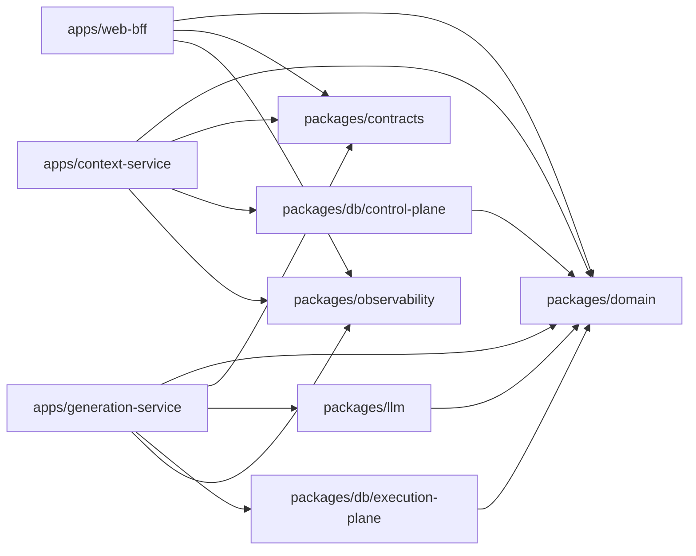
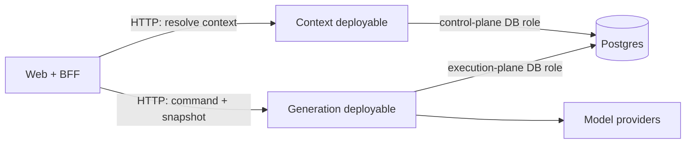

# ADR-004: Package seams for the assisted review monorepo

- **Status:** Accepted
- **Date:** 2026-08-12
- **Decision:** Three deployables, five shared packages, and caller-owned remote ports
- **Supersedes:** The six-package sketch in `01-SYSTEM-DESIGN.md` §6

## Context

The workspace will use Nx, pnpm, and TypeScript and ship three deployables:

- `apps/web-bff`
- `apps/context-service`
- `apps/generation-service`

The design sketch proposed six shared packages: `domain`, `contracts`, `llm`, `plugins`, `db`, and `observability`. The package graph must preserve three non-negotiable constraints:

1. `packages/domain` has zero I/O and never imports database, model-provider, Node built-in, or external runtime code.
2. `apps/web-bff` never imports or transitively reaches `packages/db`.
3. Generation receives an Effective Configuration Snapshot as a required invocation parameter and has no configuration-reading path.

The domain language and invariants are defined in `docs/agents/domain.md`. In particular, a Review Format Version is Platform configuration, an Effective Configuration Snapshot is an immutable input to Generation, and Price Rate is configuration rather than provider behavior.

## Decision

### The proposed six packages become five

Delete `packages/plugins` from the graph and reserve its name. Review Format Versions and Action Definitions are versioned data interpreted by the same generation implementation. There is no varying executable implementation and there are not two adapters at a plugin seam.

The responsibilities from the proposed package move as follows:

| Proposed `plugins` responsibility | New home |
|---|---|
| Review Format semantics and constraint evaluation | `packages/domain` |
| Zod schemas for Review Format wire records | `packages/contracts` |
| Loading and persisting Review Format Versions | `packages/db/control-plane`, called only by Context |
| Manifest compatibility tests | tests at the `domain` and `contracts` interfaces |

Reintroducing a plugin module requires independently authored executable extensions, a deliberately versioned executable interface, and at least two real adapters. A schema, loader, and test kit around data do not meet that bar.

### Compile-time package graph

An arrow means a permitted direct TypeScript import. Runtime HTTP calls are intentionally absent from this graph.



The exact direct-import matrix is:

| Importer | `domain` | `contracts` | `llm` | `db/control-plane` | `db/execution-plane` | `observability` | another deployable |
|---|---:|---:|---:|---:|---:|---:|---:|
| `web-bff` | yes | yes | no | no | no | yes | no |
| `context-service` | yes | yes | no | yes | no | yes | no |
| `generation-service` | yes | yes | yes | no | yes | yes | no |
| `domain` | self only | no | no | no | no | no | no |
| `contracts` | no | self only | no | no | no | no | no |
| `llm` | yes | no | self only | no | no | no | no |
| `db` | yes | no | no | internal only | internal only | no | no |
| `observability` | no | no | no | no | no | self only | no |

`packages/contracts` and `packages/domain` deliberately do not import one another. A wire record and a domain value may have similar fields but have different interfaces and evolution rules. Each deployable maps at its inbound/outbound seam so Zod and transport versioning never leak into the pure domain module.

### Runtime graph and remote seams



Context and Generation never call or import one another. The BFF owns two remote ports:

```ts
interface ContextPort {
  resolveForGeneration(input: ResolveContextInput): Promise<EffectiveConfigurationSnapshotDto>;
}

interface GenerationPort {
  execute(
    command: GenerationCommandDto,
    config: EffectiveConfigurationSnapshotDto,
    signal: AbortSignal,
  ): AsyncIterable<GenerationEventDto>;
}
```

Each port has an HTTP adapter for production and an in-memory adapter for BFF tests. That makes both seams real without sharing deployable implementation.

### Generation interface: configuration is an input, never a dependency

The generation module's external interface is:

```ts
interface GenerationModule {
  execute(
    command: GenerationCommand,
    config: EffectiveConfigurationSnapshot,
    signal: AbortSignal,
  ): AsyncIterable<GenerationEvent>;
}

function createGenerationModule(dependencies: {
  model: ModelGateway;
  journal: GenerationJournal;
  diagnostics: Diagnostics;
  clock: Clock;
  ids: IdFactory;
}): GenerationModule;
```

There is no `ConfigPort`, `ContextClient`, `ConfigRepository`, loader callback, or configuration credential in `dependencies`. The `config` parameter is required on every execution, including Regenerate. The inbound HTTP contract requires the snapshot and maps it to the domain value before calling `execute`.

The implementation hidden behind this seam performs action normalization, prompt composition, provider routing, grounding, policy and Review Format enforcement, immutable Generation construction, billing against the supplied Price Rate, persistence ordering, and event emission.

Dependency-cruiser can require an import/reachability edge and prohibit all known configuration-reading edges. It cannot inspect whether a TypeScript type occurs specifically as a non-optional function parameter, nor can it see a URL passed to the global `fetch` function. Therefore the guarantee has three complementary parts:

1. `.dependency-cruiser.cjs` requires `execute-generation.ts` to reach the Effective Configuration Snapshot type and forbids static paths to Context, control-plane storage, configuration clients, database drivers, and direct Node I/O.
2. The TypeScript interface and the required Zod request field make omission a compile-time/contract error.
3. The Generation deployment receives only execution-plane database credentials and provider credentials—never Context credentials or a configuration endpoint secret.

Claiming that dependency-cruiser alone can prove parameter position or all dynamic network behavior would be false.

## Package interfaces and the behavior they hide

### `packages/domain`

`domain` is an in-process pure module with three public feature entry points, not a type dumping ground:

- `@review/domain/configuration`: resolve scope inheritance, provenance, snapshot validation, and experiment bucketing.
- `@review/domain/review-session`: admission, Invitation Token, Assertion, and Review Session invariants.
- `@review/domain/generation`: prepare model work, validate Claim coverage/grounding, enforce policy and Review Format postconditions, calculate cost, and compute edit distance.

Production source imports only itself. Tests may use test dependencies outside `src`. Functions accept values and return values; there is no port or adapter because no behavior varies across an I/O seam.

### `packages/contracts`

`contracts` owns versioned Zod wire schemas and DTOs only:

- `@review/contracts/shared`
- `@review/contracts/context`
- `@review/contracts/generation`

It hides wire-version parsing, compatibility, and error shaping. It does not contain domain decisions, provider types, persistence records, or application ports.

### `packages/llm`

`llm` earns a package because Anthropic, OpenAI, and FakeProvider are three adapters at a real Provider seam, and timeout, breaker, failover, structured decoding, and provider error normalization sit behind one small interface:

```ts
interface ModelGateway {
  generate(request: ModelRequest, signal: AbortSignal): Promise<ModelCandidate>;
}
```

The package owns provider SDKs and invocation usage reporting. It does **not** own Price Rates, prompts, grounding, policy, Review Formats, or Generation persistence. Price Rates arrive in the Effective Configuration Snapshot and pure domain code calculates cost.

Diagnostics are injected into the gateway; `llm` does not import `observability`.

### `packages/db`

`db` is a distribution package containing three sealed adapter modules, not one generic database interface:

- `@review/db/control-plane`: configuration repositories and snapshot persistence for Context.
- `@review/db/admission`: atomic Invitation Token consumption, Review Session creation, and
  Generation Permit redemption for Context.
- `@review/db/execution-plane`: Generation journal, Draft/Disposition persistence, and immutable billing records for Generation.

There is no `@review/db` root export, raw Prisma export, arbitrary query interface, or shared generated client. Each subpath uses its own generated client and runtime database role. Common internals may establish transactions and tenant context but cannot import any role-specific adapter. The three adapters cannot reach one another, and Generation cannot reach Admission. Admission is a sealed Context-owned seam rather than a fourth deployable, so the BFF remains database-free.

If `db` becomes an omnibus Prisma barrel, it fails this ADR and should split into separate packages. It earns its current distribution package by hiding migrations, tenant-context transactions, RLS-safe access, atomic admission/append semantics, and credentialed clients.

### `packages/observability`

`observability` earns a package only as a deep diagnostics module. Its small interface hides correlation propagation, redaction, metric names, cardinality policy, EMF formatting, trace/log linkage, and an in-memory recording adapter for tests. It must not become a logger re-export; if it does, delete it and keep the adapters inside deployables.

## Dependency-cruiser enforcement

The normative rules are executable in the repository root `.dependency-cruiser.cjs`. CI runs:

```sh
pnpm exec depcruise apps packages --config .dependency-cruiser.cjs --output-type err
```

Rule coverage is explicit:

| Architectural constraint | Enforcing rule names |
|---|---|
| Domain has zero I/O and cannot import DB or LLM | `domain-no-workspace-dependencies`, `domain-never-imports-db-or-llm`, `domain-no-node-builtins`, `domain-no-external-dependencies` |
| BFF never reaches DB | `web-bff-cannot-reach-db`, `web-bff-no-database-drivers`, `web-bff-workspace-dependencies` |
| Generation receives the snapshot and has no configuration-reader path | `generation-execute-depends-on-effective-config-snapshot`, `generation-handler-validates-wire-request`, `generation-cannot-reach-context-service`, `generation-cannot-reach-control-plane-readers`, `generation-cannot-reach-context-client-contracts`, `generation-db-imports-execution-plane-only`, `generation-no-direct-db-or-config-clients`, `generation-no-direct-node-io`, `generation-core-no-io-dependencies`, `generation-core-no-external-runtime-dependencies` |
| Deployables communicate only over wire seams | `no-cross-deployable-imports`, `packages-never-import-deployables` |
| DB adapter modules and credentials remain disjoint | `context-db-imports-control-plane-only`, `generation-db-imports-execution-plane-only`, `db-execution-plane-cannot-reach-control-plane`, `db-control-plane-cannot-reach-execution-plane`, `db-common-cannot-reach-role-adapters`, `no-db-root-or-internal-imports` |
| The selected package graph is closed by default | the three `*-service-workspace-dependencies`/`web-bff-workspace-dependencies` rules and the four `*-workspace-dependencies` package rules |
| Rejected plugin package cannot creep back through an import | `no-plugins-package-imports` |
| Graph remains resolvable and acyclic | `not-to-unresolvable`, `no-circular` |

The rules inspect production and type-only imports (`tsPreCompilationDeps: "specify"`). A deliberate violation is a CI error, not a warning.

## Alternatives considered

### Keep all six packages

Rejected. `plugins` would expose almost as much interface as implementation: schema, loader, and test kit. Deleting it removes indirection rather than redistributing behavior among callers. More importantly, a runtime loader in Generation creates pressure for a second configuration acquisition path.

### Put Provider adapters inside Generation

Rejected for now. There are already three adapters, shared provider contract tests, and substantial breaker/failover/error-normalization behavior. `llm` has a real seam and a small interface even though Generation is its only production caller. Reconsider if it degenerates into provider SDK re-exports.

### Put persistence adapters inside each deployable

Viable, but not selected. It gives maximum locality, while duplicating migration, tenant-context, and RLS-safe transaction machinery. The selected `db` package keeps that behavior local while using sealed subpath interfaces and separate clients/roles. If those subpaths begin sharing a generic client, split them immediately.

### Let Context call Generation

Rejected. It couples the control plane to execution and makes configuration acquisition implicit. The BFF already owns orchestration, so it resolves a snapshot and passes that immutable value into Generation.

## Consequences

- The dependency graph is acyclic and every deployable has a closed package allow-list.
- Domain tests exercise pure interfaces without mocks or adapters.
- The BFF can use HTTP and in-memory adapters at its two owned remote seams but cannot bypass them through Postgres.
- Generation can be replayed against an explicit snapshot without knowing where configuration came from.
- Review Format changes remain data changes and do not require executable plugin loading.
- Wire DTOs and domain values require explicit mapping. This small duplication is intentional and prevents transport concerns from becoming domain language.
- Database role separation is visible in imports, generated clients, and deployment credentials rather than merely documented.
- Adding a package or dependency requires changing the allow-list in the same review, making architectural expansion deliberate.
