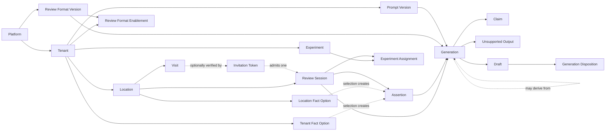

# Assisted review-writing domain model

Status: proposed canonical model and ubiquitous language  
Sources: `01-SYSTEM-DESIGN.md` §§3–5 and the `FIXTURES` contract in `prototypes/Survey.dc.html`

This document is normative for domain language. Existing fixture names are noted as compatibility names, not allowed to redefine the concepts.

## 1. Modeling rules

1. **Scope means where configuration applies and inherits, not who is allowed to edit it.** A tenant-scoped budget may still be editable only by a platform operator.
2. **Configuration and operational data are different.** Platform, Tenant, and Location are configuration scopes. A Review Session or Generation is operational data attributed to one of those scopes; it is not another layer in the configuration cascade.
3. **Every stored configuration value has exactly one owning scope.** A resolved value is derived, never re-owned by the child scope that consumes it.
4. **Absence means inheritance.** A Location Override contains only deliberate differences. Resetting a field removes the override.
5. **Grounding is semantic.** Character spans and selected option ids are evidence anchors; string containment is not the grounding rule.

The effective value of an overrideable field is:

```text
Location override, if present
otherwise Tenant value, if present
otherwise Platform default
```

Resolution must return both the value and its supplying scope. `null` must not be used to mean both “inherit” and “explicitly empty.” In the current fixture, `location.entryMode: null` is therefore not a second override mechanism: it means **no Location override**. An actual override belongs only in `location.overrides.entryMode`.

## 2. Ubiquitous language

### Canonical terms

| Canonical term | Definition | Required usage |
|---|---|---|
| **Platform** | The vendor-owned product and global catalogue boundary. | Keep `platform`. |
| **Tenant** | One isolated customer account: the billing, policy, prompt, experiment, and data-isolation boundary. A Tenant may represent a business with several Locations. | Keep `tenant`. Use “business” only for customer-facing copy or the Tenant's Business Profile. |
| **Location** | One physical branch, clinic, restaurant, or other place whose review destinations and local configuration are distinct. | Keep `location`; stop using **venue** as a domain synonym. |
| **Visit** | A real-world customer experience at one Location. It may be verified or unverified. | Keep `visit`; never use it for time spent in this product. |
| **Invitation Token** | A single-use credential that can prove or refer to a Visit and admit one Review Session. | Use instead of **visit token**. The token is evidence about a Visit, not the Visit itself. |
| **Review Session** | One reviewer's interaction with the product at one Location, from entry through drafting/copying. It may be linked to a Visit. | Use instead of bare **session** or `SurveySession`. Use **Operator Session** for a console login. |
| **Fact Option** | A tenant- or location-authored factual proposition a reviewer may select. Selection does not itself change the option; it creates an Assertion. | Use instead of **keyword**. These records are propositions, not search terms. |
| **Assertion** | A proposition explicitly supplied or confirmed by the reviewer, with provenance. Sources include a selected Fact Option, reviewer text, a confirmed added fact, and a rating for the limited sentiment it actually expresses. | Keep `assertion`; do not use it for model output or for an arbitrary instruction. |
| **Claim** | One semantic proposition expressed by generated review text and grounded in one or more Assertions or permitted verified context facts. | Keep `claim`; do not use it for raw reviewer input or rejected model text. |
| **Unsupported Output** | A candidate proposition emitted by a model but rejected by grounding or policy. It is retained only for audit/explanation and never appears in the Draft. | Use instead of **removed claim**. An ungrounded proposition is not a Claim in this model. |
| **Action** | A requested drafting operation with an explicit input contract and semantic postcondition. | Keep `action`, but see the action taxonomy in §7: Regenerate is a resampling command, and Refine is currently overloaded. |
| **Generation** | One immutable execution record of the generation pipeline: request binding, versions, provider call, candidate result, grounding result, policy result, usage, and cost. | Keep `generation`; never use it to mean the editable review text. |
| **Draft** | Reviewer-editable review text created from a successful Generation. A Draft may change without rewriting the immutable Generation that produced it. | Keep `draft`; never use it to mean a provider invocation or audit record. |
| **Review Format** | A versioned platform catalogue entry defining output shape and limits, such as character range, paragraph count, locale support, and target destination type. | Use instead of **style**. The current catalogue is structural; Tenant tone is a separate concern. |
| **Reformat** | Render grounded Claims in a different Review Format. | Use instead of the action name **Restyle**. The compatibility action key may remain `restyle` until the contract is migrated. |
| **Prompt Version** | An immutable tenant-owned prompt-content artifact for one Action. Deployment status and evaluation results are separate mutable records. | Do not call an edited prompt the same version. |
| **Effective Configuration Snapshot** | An immutable, location-attributed materialization of all values used by a Generation, including per-field scope provenance. | Do not use the Tenant's `contextVersion` as a synonym; it cannot identify Location overrides by itself. |
| **Generation Disposition** | The reviewer's response to a Generation/Draft candidate: accepted, edited, or discarded. | Use instead of generic **outcome** where this specific concept is meant. |
| **Posting Destination** | An external listing/page to which the reviewer may manually paste a Draft. | Do not call the destination type and a Location's bound external page the same entity. |

### Terms that are deliberately not synonyms

- **Tenant / Location:** account boundary versus physical branch.
- **Location / Visit:** enduring place versus one customer's occurrence there.
- **Visit / Review Session:** real-world experience versus product interaction.
- **Operator Session / Review Session:** administrative authentication context versus reviewer workflow.
- **Assertion / Claim:** reviewer-authorized input proposition versus generated output proposition.
- **Generation / Draft:** immutable execution record versus mutable text artifact.
- **Tenant Tone / Review Format:** voice guidance versus structural output shape.

Stop using these domain terms: **venue**, bare **session**, **keyword**, **style**, **Restyle**, **visit token**, **removed claim**, and generic **outcome** when Generation Disposition is intended.

## 3. Domain shape



Aggregate and lifecycle rules:

- Platform, Tenant, Location, Review Session, Generation, and Draft are distinct lifecycle roots or records; none is a synonym for another.
- A Review Session belongs to exactly one Tenant and one Location. Its Assertions, Generations, Drafts, and Experiment Assignment cannot cross that boundary.
- A Generation is immutable. Reviewer edits change the Draft or create Draft revisions, not the Generation's recorded model output.
- A derived Generation references an earlier Generation in the same Review Session. The lineage is acyclic.
- A Claim keeps transitive provenance to its original Assertion even when a later Action derives it through another Generation.

## 4. Entity ownership catalogue

The catalogue is exhaustive for identity-bearing concepts present or necessarily implied by the two source artifacts. “Owner” below is the configuration scope at which the entity is defined, or the scope to which an operational entity is attributed. It does not grant edit permission.

### Configuration entities

| Entity | Owner | Identity and boundary |
|---|---|---|
| **Platform** | Platform | The single platform configuration root. |
| **Provider** | Platform | A model-service provider definition. Health and latency are projections, not provider identity. |
| **Provider Model** | Platform | A provider-qualified model and its declared capabilities. A bare model id is not globally unique. |
| **Price Rate** | Platform | An immutable, effective-dated price for one Provider Model. It needs a stable rate id. |
| **Feature Flag** | Platform | A keyed platform capability switch. If tenant targeting is later added, the flag definition remains Platform-owned and targeting rules become separate entities. |
| **Review Format Version** (`STYLE_PLUGIN`, `styles`) | Platform | Key plus immutable version. Localized labels/samples and constraints belong to this version. |
| **Action Definition** (`actionCatalog`) | Platform | Stable action key, input contract, and availability metadata. It must not be allowed to redefine semantic grounding. |
| **Posting Destination Type** (`destinations`) | Platform | Google Maps, Tripadvisor, Facebook, Yelp, and the external-id schema each requires. |
| **Entry Mode Definition** (`entryModes`) | Platform | Invite, open QR, or both, with route semantics. Tenant/Location values select a definition. |
| **Operator Role Definition** (`roles`) | Platform | Platform admin, agency operator, or tenant operator capability set. |
| **Tenant** | Tenant | Tenant scope root and isolation/billing boundary. Platform provisions it; that does not make its configuration Platform-scoped. |
| **Fact Category** (`keywordCategories`) | Tenant | Tenant-specific taxonomy entry. A Location Fact Option must reference a category of its own Tenant. |
| **Fact Option** (`keywords`) | Tenant **or** Location, per instance | A base option is Tenant-owned; an addition is Location-owned. One option can never have both owners. |
| **Review Format Enablement** (`enabledStyles`) | Tenant | Joins one Tenant to one Platform Review Format key. It is not a copied Format. |
| **Action Enablement** (`enabledActions`) | Tenant | Joins one Tenant to one Action Definition. |
| **Prompt Version** (`promptVersions`) | Tenant | Immutable prompt content for one Tenant and Action. Lifecycle/evaluation state must not be part of the immutable content identity. |
| **Experiment** | Tenant | A Tenant's controlled comparison for one Action. |
| **Experiment Variant** | Tenant | Child of one Experiment; references a Prompt Version of the same Tenant and Action. |
| **Operator Access Grant** | Tenant | Links a Platform Operator to a Tenant and an allowed role. This replaces the inaccurate blanket relationship “Tenant employs Operator.” |
| **Location** | Location | Location scope root; also a child of exactly one Tenant. |
| **Posting Destination Binding** | Location | Enables one Platform Posting Destination Type at one Location and carries that Location's external page/place id. |

### Operational entities and projections

These do not participate in configuration inheritance, but each still has an unambiguous attribution scope.

| Entity | Attribution | Boundary |
|---|---|---|
| **Operator** | Platform | Human administrative identity. Cross-tenant agency and platform roles make Tenant ownership incorrect. |
| **Operator Session** (top-level fixture `session`) | Platform | Authentication/authorization context plus active Tenant selection; not a Review Session. |
| **Visit** | Location | Real-world occurrence at one Location. It is missing as a first-class fixture entity. |
| **Invitation Token** (`visitTokens`) | Location | Credential issued for one Location and, on the invited path, one Visit. It admits at most one Review Session. |
| **Review Session** (`SURVEY_SESSION`) | Location | Reviewer workflow at one Location, within its Tenant. |
| **Assertion** | Location, through Review Session | Immutable reviewer-authorized proposition and its source anchor. |
| **Experiment Assignment** | Location, through Review Session | Stable assignment of one Review Session to a Tenant Experiment Variant. |
| **Effective Configuration Snapshot** | Location, through Review Session/Generation | Derived snapshot spanning all three configuration scopes; not independently editable. |
| **Generation** | Location, through Review Session | Immutable pipeline execution and audit record. |
| **Claim** | Location, through Generation | Grounded semantic proposition in generated output. It needs stable identity within a Generation. |
| **Unsupported Output** (`removedClaims`) | Location, through Generation | Rejected candidate proposition and reason; never part of the Draft. |
| **Draft** | Location, through Review Session | Mutable reviewer-facing text derived from a successful Generation. |
| **Generation Disposition** (`OUTCOME`, `outcome`) | Location, through Draft/Generation | Accepted, edited, or discarded decision and measurements such as edit distance. |
| **Location Funnel Counters** (`counters`) | Location | Derived projection, not Location configuration. |
| **Analytics Cell** (`analytics`) | Location | Derived projection keyed by Location × Action × Review Format × Experiment Variant. |
| **Provider Health** (`health`, `p95Ms`) | Platform | Derived operational projection, not Provider configuration. |
| **Tenant Usage** (`monthToDateCostMicros`) | Tenant | Derived billing projection, not Tenant configuration. |

### Scoped value objects, not entities

These have no independent identity or lifecycle and should not be promoted to entities without a reason:

| Value object | Owner |
|---|---|
| Provider routing policy, default policy template, global rate limits, retention policy | Platform |
| Review Format constraints and localized catalogue text | Platform, as part of Review Format Version |
| Localized customer-facing copy bundle | Platform; Tenant locale only selects from it |
| Business Profile, Tenant tone, Tenant policy, default Entry Mode, budget policy | Tenant |
| Location address and Location Override set | Location |
| Claim grounding reference, source span, grounding verdict, token usage, cost calculation | Parent operational entity |

The fixture's `embellishments` array is a test-case catalogue, not a production domain entity.

## 5. Scope ambiguities that must be resolved now

### 5.1 Operator ownership

The ER diagram says a Tenant employs Operators, while the fixture has platform-wide and agency Operators assigned across Tenants. One Operator entity cannot honestly be Tenant-owned in all three cases.

**Decision:** Operator identity and Operator Session are Platform-attributed. Tenant-owned Operator Access Grants express membership/assignment. A Tenant operator has one grant; an agency operator has several; a platform admin is authorized by a Platform role rather than synthetic membership in every Tenant.

### 5.2 Fact Option ownership

The same shape appears under Tenant keywords and Location additions. That is valid only if ownership is explicit per instance.

**Decision:** use one Fact Option concept with exactly one owner discriminator: Tenant or Location. A Location option must reference a Fact Category owned by the Location's Tenant. It cannot be promoted to Tenant scope merely by moving a row; that is a new option with a new identity.

### 5.3 Entry Mode overrides

The fixture contains both `location.entryMode` and `location.overrides`, while §3 says all Location overrides resolve from the latter.

**Decision:** `location.overrides` is authoritative. A top-level `entryMode: null` means “no override” for fixture compatibility and must never mean an explicit null value. A non-default Location Entry Mode is stored as an override, not in a parallel field.

### 5.4 Destination catalogue versus bound destination

`destinations.google` defines what a Google destination is; `location.platformIds.googlePlaceId` identifies one Location's Google page. They are different entities.

**Decision:** Platform owns Posting Destination Types; Location owns Posting Destination Bindings. A binding is valid only when it contains the external id required by its type.

### 5.5 Visit versus Invitation Token

The current token record also carries `visitedOn`, making the credential stand in for the occurrence it verifies. That fails for token rotation, multiple invitations, expiration, and audit.

**Decision:** model Visit separately. An Invitation Token references the Visit when one is known. Open-QR sessions may have no verified Visit. Verification policy governs admission; it does not turn a Review Session into a Visit.

### 5.6 Generation versus Draft

The fixture stores editable `draft` text on a Generation while also treating Generations as reproducible audit records. Reviewer edits would destroy that audit record if the same field were updated.

**Decision:** Generation preserves provider output and its Claim map immutably. Draft preserves reviewer-editable text and revision history if edits are persisted. Generation Disposition measures the chosen Draft against its originating Generation.

### 5.7 “One invitation, one draft” versus draft caps

The UI copy says one invitation produces one assisted draft, while policy values allow two or three `maxDraftsPerSession`. The prototype uses that value to cap the number of Review Formats selected for one request, not the lifetime number of Generations in a Review Session.

**Decision:** one Invitation Token admits one Review Session, not one provider call and not one text alternative. The canonical policy concept is **maximum formats per request**. The fixture field `maxDraftsPerSession` is misnamed and must not set domain vocabulary; rename it before the contract is frozen, or document it as a compatibility field with `maximum formats per request` semantics. Rate limiting counts actual Generation attempts separately.

### 5.8 Prompt immutability

Prompt records mix content identity with mutable `status` and `evalScore`.

**Decision:** the Prompt Version's action/key/body are immutable and content-addressed. Evaluation results and deployment state are separate Tenant-owned records. Retiring a Prompt Version does not mutate or delete its content.

### 5.9 Context version

A Tenant `contextVersion` cannot uniquely identify Location overrides or their provenance.

**Decision:** every Generation references an Effective Configuration Snapshot id/hash. The snapshot contains resolved values and per-field provenance. Tenant and Location revisions may help construct it, but neither is a substitute for it.

## 6. Invariants

### Assessment of the original seven

| Original | Verdict | Canonical replacement |
|---|---|---|
| **I1 — every stored Claim traces to a selected keyword, customer-text span, or instruction** | **A real invariant, but incomplete and partly wrong.** It does not require every proposition in Draft text to have a Claim, so untracked prose can bypass it. “Recorded instruction” is not necessarily an Assertion. The `clean` fixture already contains “for a check-up and clean” without a Claim/source. | G1–G4 below: complete Claim coverage plus grounding to Assertions or narrowly permitted verified context. An Unsupported Output is not a Claim. |
| **I2 — every derived Generation's Claim set is a subset of its source's** | **Not an invariant as stated.** Regenerate may express a grounded Assertion omitted by the previous sample; fact-adding revision deliberately adds confirmed Assertions; “derived” is too broad. | A1–A6 below define a separate semantic postcondition for each Action. |
| **I3 — a Generation is fully reproducible from its id and listed versions/params** | **Not an achievable invariant.** An id is a lookup key, the listed data omits the exact inputs and effective Location configuration, and an external model may be nondeterministic or silently revised. | P1: a Generation is fully auditable and replayable from immutable inputs/artifacts. Replay does not promise byte-identical output. |
| **I4 — no row is readable outside a tenant session; RLS enforces it** | **Two different statements.** Tenant isolation is a security invariant. “RLS, not query construction” is an implementation/enforcement decision, and “no row” is false for Platform catalogue rows and authorized cross-tenant operators. | S1–S2 specify which rows require matching Tenant authorization. Keep RLS as an architecture/test requirement outside the ubiquitous language. |
| **I5 — Prompt Version is immutable; editing makes a new hash** | **Valid only for prompt content.** `status` and `evalScore` are mutable lifecycle/evaluation data and must be separated. | P2. |
| **I6 — experiment assignment is stable for a session id** | **Valid after naming the session.** The id must be a Review Session id, and the referenced Variant must remain resolvable. | E1–E3. |
| **I7 — cost uses the price row effective at Generation time and old rows remain** | **Valid, but not supported by the current fixture shape.** Price rows lack stable ids, and Generation does not reference one. | B1–B3. |

### Canonical, testable propositions

#### Configuration and ownership

| ID | Proposition |
|---|---|
| C1 | For every persisted configuration field, exactly one of Platform, Tenant, or Location is recorded as its owning scope. |
| C2 | Given values at all three allowed scopes, resolution returns the Location value; without it, the Tenant value; without either, the Platform default. |
| C3 | Removing a Location override causes the next resolution to inherit the then-current Tenant/Platform value; reset never stores a copied parent value. |
| C4 | Every field in an Effective Configuration Snapshot records the scope and source revision/version that supplied it. |
| C5 | A Location override is rejected for any field not present in the explicit Location-override allow-list. Provider credentials, Price Rates, Review Format definitions, prompts, experiments, and budgets are not Location-overridable under the current model. |
| C6 | Changing any effective input to a Generation changes the Effective Configuration Snapshot identity for affected Locations; unrelated Tenant/Location changes do not. |
| C7 | A Tenant/Location can select only existing Platform definitions, and a Location-owned reference can point only to its own Tenant or to Platform catalogue data. |

#### Identity, isolation, and lineage

| ID | Proposition |
|---|---|
| S1 | A Review Session, all of its Assertions, Generations, Claims, Drafts, and Dispositions have the same Tenant and Location attribution. |
| S2 | A Tenant-attributed record is readable or writable only with a matching active Tenant authorization, except for an explicit Platform-admin authorization; Platform catalogue records are not subject to this tenant-match rule. |
| S3 | `sourceGenerationId`, when present, identifies an earlier Generation in the same Review Session; following source links always terminates and never forms a cycle. |
| S4 | Deactivating a Tenant, Location, Fact Option, Review Format enablement, or Action enablement prevents new use but does not invalidate historical Generations that reference the prior version. |

#### Admission and reviewer authority

| ID | Proposition |
|---|---|
| R1 | A valid unused Invitation Token can create at most one Review Session, and token consumption plus session creation is atomic. Reusing it returns the existing/closed-session outcome rather than creating another session. |
| R2 | An Invitation Token can admit a Review Session only for the same Tenant and Location—and, when linked, the same Visit—as the token. |
| R3 | If effective policy requires a verified Visit, generation cannot begin until the Review Session has valid verification evidence. Open QR alone is insufficient. |
| R4 | A Generation request is rejected unless its Location is active, its Review Session is open, and the reviewer supplied a rating in the range 1–5. |
| R5 | A rating may ground the rating/sentiment actually expressed, but it does not imply a factual event or future intent such as “I would go back.” |
| R6 | One Generation request selects no more than the effective maximum number of Review Formats. Provider invocations and rate-limit accounting count Generations, not Invitation Tokens or Draft edits. |

#### Grounding, Draft integrity, and derivation

| ID | Proposition |
|---|---|
| G1 | Every factual or evaluative proposition present in persisted/generated Draft text is represented by at least one Claim, except separately marked system-authored annotations such as disclosure text. |
| G2 | Every Claim has at least one valid grounding reference to an Assertion in the same Review Session or to an explicitly permitted verified context fact such as Location identity or verified visit date. |
| G3 | A reviewer-text grounding reference identifies an exact source span and the immutable source-text revision; selecting a Fact Option records the exact option/version selected. |
| G4 | A derived Claim retains transitive grounding to original Assertions; a parent Claim id alone is not sufficient provenance. |
| G5 | Unsupported model output never appears in the Draft or Claim set. If retained for explanation/audit, it is stored as Unsupported Output with a rejection reason. |
| G6 | After grounding or policy removes or rewrites text, Claim coverage, grounding, banned-term policy, and Review Format constraints are validated again before persistence. |
| G7 | If grounding and Review Format constraints cannot both be satisfied, grounding wins and the Generation is rejected; the pipeline never adds a proposition merely to meet a minimum length or paragraph count. |
| G8 | A successful Generation's provider output, Claim set, grounding result, versions, inputs, usage, and cost are immutable. Reviewer edits create/update Draft revisions and cannot mutate that record. |
| G9 | A system disclosure is a policy annotation with system provenance, not a reviewer Claim; adding it cannot alter the reviewer's Claim set. |

#### Action availability and semantic postconditions

| ID | Proposition |
|---|---|
| A1 | An Action is available only when the Tenant enables it, the target Review Format supports it and the Tenant locale, and its required inputs are present. All three conditions are necessary. |
| A2 | Generate Claims are a subset of Claims supported by the request's Assertions and permitted verified context; no configured Fact Option becomes an Assertion until the reviewer selects it. |
| A3 | Paraphrase adds no proposition absent from the reviewer's source text. If the product promises fact preservation, every in-scope source proposition must also remain represented unless policy explicitly rejects it and reports why. |
| A4 | Reformat and Condense produce no Claim outside the source Generation's Claim set. Condense also produces shorter Draft text and may drop whole Claims. |
| A5 | Expand produces longer Draft text while preserving the source Claim set exactly, except Claims explicitly removed by policy. If it cannot become longer without a new proposition, it is rejected. |
| A6 | Regenerate reuses the originating request's Assertion set, Prompt Version, Review Format Version, and Effective Configuration Snapshot. Its Claim set is bounded by that original grounding set, not by the previous sample's realized Claim set. |
| A7 | A presentation instruction such as “make it warmer” cannot create an Assertion. A fact-bearing addition such as “parking was easy” enters the grounding set only after it is captured/confirmed as a new Assertion. |

#### Prompts and experiments

| ID | Proposition |
|---|---|
| P1 | Looking up a Generation yields or resolves the exact normalized input, Assertion versions, Effective Configuration Snapshot, Prompt Version, Review Format Version, provider/model parameters, and provider response needed for audit and replay. Replay is not required to be byte-identical. |
| P2 | Once a Prompt Version hash is issued, its action/key/body cannot change; editing content issues a new hash, while evaluation and deployment state changes do not alter the content artifact. |
| E1 | One Review Session receives at most one assignment per Experiment. |
| E2 | Once assigned, a Review Session's Variant does not change when weights change or the Experiment stops. |
| E3 | Every Variant references a non-retired-at-assignment Prompt Version owned by the same Tenant and Action, and historical references remain resolvable after retirement. |

#### Billing

| ID | Proposition |
|---|---|
| B1 | For every billed provider call, exactly one immutable Price Rate is effective for its Provider Model and billing timestamp. |
| B2 | Every Generation records the Price Rate id, billed input/output quantities, calculated cost, and currency/unit; recalculation from those fields produces the stored cost. |
| B3 | Superseding a Price Rate closes/replaces it prospectively and never changes the calculated cost of an existing Generation. |

## 7. Do the seven actions form one pipeline?

They can share one **orchestration pipeline**, but they are not seven equivalent transformations. The common shape is defensible only after each command normalizes its inputs into (a) an allowed Assertion/Claim grounding set and (b) non-semantic presentation constraints.

| Current action | Grounding binding and postcondition | Fit verdict |
|---|---|---|
| **Generate** | Bind selected Fact Option Assertions, free-text Assertions, rating, and permitted verified context. Output Claims must be supported by that set. | **Fits.** Do not treat all configured options as asserted. |
| **Paraphrase** | Derive Assertions/propositions from immutable reviewer source text and retain span anchors. Output must be semantically supported by those spans. | **Fits with preprocessing.** `claim ⊆ spans(text)` is not a meaningful literal set predicate; it must mean semantic support. If “preserve every fact” is a promise, subset alone is too weak. |
| **Regenerate** | Re-run the originating normalized request with a new sample while retaining its grounding set and immutable versions. | **Uses the same pipeline, but is not a semantic transformation Action.** It is a resampling command. `needsDraft: true` is misleading; it needs the prior Generation request, not editable Draft text. |
| **Restyle** → **Reformat** | Bind the source Generation's grounded Claims and a different Review Format Version. Output Claims are a subset of source Claims. | **Fits.** The action and catalogue should use Format language. |
| **Condense** | Bind source Claims plus a lower length target. Output is shorter and contains only a subset of source Claims. | **Fits.** Define whether dropping Claims is allowed; the current prompt says it is. |
| **Expand** | Bind source Claims plus a higher length target. Output is longer but semantically equivalent: the Claim set remains equal. | **Fits only with a stronger predicate.** The current subset rule is too weak for expansion and encourages filler. Impossible expansions must reject. |
| **Refine** | Currently binds `source claims ∪ {instruction}` and treats the entire instruction as a fact. | **Does not fit as currently defined.** Instructions are not uniformly grounding evidence. Split this into a presentation-only **Revise Wording** command and an **Add Fact** flow, or constrain Refine to confirmed fact additions plus a separate presentation instruction. Only after normalization can it enter the common pipeline. |

The corrected common pipeline is:

1. Authorize the Operator/Reviewer context and validate Review Session admission.
2. Validate Action prerequisites and Review Format availability.
3. Resolve and freeze the Effective Configuration Snapshot.
4. Normalize inputs into Assertions/permitted context facts plus presentation constraints.
5. Bind the Action-specific semantic postcondition.
6. Compose with the immutable Prompt Version and Review Format Version.
7. Call the Provider and receive structured candidate text plus a complete Claim map.
8. Enforce Claim coverage and grounding; separate Unsupported Output.
9. Apply policy and structural constraints.
10. Re-run coverage, grounding, and policy/format validation.
11. Persist the immutable Generation, create/update the Draft, record billing, and emit projections.

This is one pipeline skeleton with different binders and postconditions. Regenerate is a re-execution mode, and the current Refine contract must be repaired before it can honestly use that skeleton.

## 8. Contract corrections before schemas become load-bearing

The following are domain corrections, not application-code instructions:

1. Add first-class ids/links for Review Session, Visit, Assertion, Claim, Effective Configuration Snapshot, Price Rate, and Draft; Generation fixtures currently cannot prove their declared containment or lineage.
2. Replace the conceptual names `keyword`, `style`, `SurveySession`, `visitToken`, `removedClaims`, and `outcome` with the canonical terms in §2. If wire compatibility is temporarily required, document the mapping at the boundary.
3. Separate Prompt Version content from prompt status/evaluation.
4. Separate Provider/Location/Tenant configuration from health, counters, and usage projections currently embedded in the same fixture records.
5. Make Location overrides use one representation and one presence rule.
6. Give Price Rates stable ids and make every Generation reference the exact rate used.
7. Replace Tenant-only `contextVersion` as generation provenance with an Effective Configuration Snapshot reference.
8. Represent system disclosure separately from reviewer Draft Claims.
9. Repair Review Format examples/requirements that invent semantics. In particular, “whether you would go back” is not implied by a rating, and format prose must never supply an unasserted experience.
10. Repair Refine before treating the seven-item catalogue as a uniform Action set.
