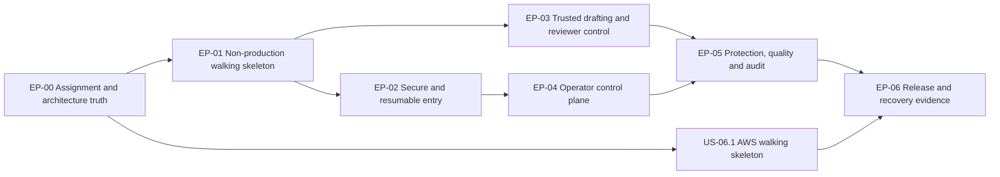

# Product delivery epics: prototype to assessed system

- **Status:** Accepted for implementation on 2026-08-17; US-00.1 remains blocked on the missing assignment source
- **Date:** 2026-08-16
- **Replaces as planning authority:** the layer-first TS-01-TS-21 sequence

The existing TS stories remain implementation history and reusable test evidence. They are not backlog
authority where they conflict with an accepted ADR, the canonical domain model or this plan.
These Epics are vertical: a story is complete only when its user-visible path crosses the confirmed
module/API interfaces and has executable evidence.

## 1. Delivery rules

Every story below must satisfy the applicable parts of this Definition of Done:

- Uses canonical language: Location, Review Session, Fact Option, Assertion, Claim, Generation, Draft,
  Review Format, Resample, Reformat, Revise Wording and Add Assertion.
- Runs through React -> BFF -> service ports; production code does not read prototype fixtures,
  `localStorage` identity, hard-coded Tenants or demo success fallbacks.
- Has a failing public-interface test before implementation and passes `pnpm verify` when complete.
- Includes loading, empty, failure, retry/cancel and input-preservation behavior where relevant.
- Meets WCAG 2.2 AA acceptance for keyboard, focus, names/roles, live regions, contrast and reduced motion.
- Proves that a second structurally different Tenant works through data, not component/service branches.
- Adds an isolation/grounding/budget/authorization adversarial test when the story touches that boundary.
- Emits redacted, low-cardinality diagnostics and has an operationally useful failure code.
- Has a real deployed smoke test when marked `Release evidence`; screenshots or prose alone do not count.
- Never publishes a review. Copy and a reviewer-chosen outbound link are the only terminal integration.

## 2. Epic map and sequence

This is not a waterfall. Deploy US-06.1 with the thinnest EP-01 path first, then deepen safety and
product behavior. Implement the OpenAI/Gemini/Fake adapters, but defer public live-provider evidence,
experiments and nonessential Console views until D0 and an explicit provider credit resolve them.

## EP-00 — Assignment and architecture truth

**Outcome:** a reviewer can distinguish requirements, accepted decisions, proposals and real evidence.

| Story | User story | Acceptance evidence |
|---|---|---|
| US-00.1 Capture the assignment contract | As the assignment reviewer, I need each claimed requirement linked to the original brief so that optional architecture is not presented as mandatory. | Commit the original brief or an immutable excerpt; a trace table maps every requirement to an Epic/story/test/demo. Items not in the source are labelled assumptions. |
| US-00.2 Ratify the open decisions | As the delivery owner, I need D0-D12 resolved so that product, frontend, AWS, identity, retention, quota, grounding UX and paid-work protocol have one target. | Record the answers as accepted ADR(s); `docs/SYSTEM-ARCHITECTURE.md` status changes from Proposed only when all blocking decisions are resolved. |
| US-00.3 Restore truthful repository status | As a reviewer, I need docs to distinguish implemented, tested and deployed so that evidence is credible. | Remove/mark fake deploy and rollback claims; no workflow prints “deployed” or “smoke passed” without executing and checking a real command; stale TS stories point here. |

## EP-01 — Non-production walking skeleton

**Outcome:** an evaluator can exercise the real responsive path through all three deployables with only
synthetic Tenant/reviewer data and the deterministic FakeProvider. It is access-restricted preview evidence,
not a public customer release or proof that the later security Epics are complete.

| Story | User story | Acceptance evidence |
|---|---|---|
| US-01.1 Production React shell | As a reviewer, I need the designed experience to load quickly on my phone rather than opening a prototype harness. | React/Vite renders `/start/:entryChallengeHandle` and `/review/:reviewSessionHandle`; Maue tokens/primitives are used; `/console` is lazy-loaded; dependency-cruiser prevents frontend imports of server/Node/domain/db/llm/observability; production bundle contains no `.dc.html`, fixture store, `?state`, Tenant switcher or prototype `localStorage`; 320/375/768/1024 px visual tests pass. |
| US-01.2 Typed Survey journey | As a reviewer, I need Back, retry, cancel and refresh to return me to a valid state without losing confirmed input. | An executable matrix covers all 20 prototype labels, every permitted event, rejected impossible transitions, browser Back, refresh and focus destination; the pure transition table is the implementation under test. |
| US-01.3 Walking-skeleton Draft | As an evaluator, I can rate a synthetic Visit, confirm an Assertion, choose one Review Format, see non-content progress, receive a deterministic grounded Draft and copy it. | Access-restricted Playwright crosses browser -> Hono BFF -> real Context/Generation ports -> test Postgres with a synthetic Tenant and FakeProvider; terminal text appears only after the guard passes; Clipboard rejection stays on results; no real invitation, customer data, live provider or external write occurs. |
| US-01.4 Accessible localized experience | As an English or German reviewer, I can understand and operate the complete skeleton with keyboard or assistive technology. | All structural strings have `en-GB`/`de-DE` resources; axe/manual keyboard checks cover unique multi-Draft ids, status/progress semantics, `aria-current`, `aria-sort`, banners, login form submission, state-change focus and table overflow; live regions do not announce generated text word by word; reduced motion is honored. |

## EP-02 — Secure and resumable entry

**Outcome:** the right reviewer enters exactly one Location-bound Review Session, can safely resume it,
and learns nothing about other Tenants from invalid paths.

| Story | User story | Acceptance evidence |
|---|---|---|
| US-02.1 Uniform link preparation | As an invited or QR reviewer, I need the link to resolve the intended Location without a scanner consuming it or making me select a Tenant. | BFF asks Context for a short-lived browser-bound Entry Challenge and redirects without exposing the token to JavaScript; GET/prefetch never consumes the token; Tenant/Location/token mismatch, unknown, malformed and expired cases have one public status/body/timing class; CloudFront/BFF/application sink tests prove query tokens are excluded/redacted; `?state` cannot bypass admission. |
| US-02.2 Atomic verification and Review Session creation | As an invited reviewer, I need my explicit Start action to admit one Review Session without a reused token exposing the prior review. | The browser-bound Entry Challenge persists provisional rating/Action choice across refresh. If effective policy needs more evidence it moves to pending verification without consuming the token; a successful server verification then atomically consumes token + creates Review Session, while an already-proven/open-QR path admits directly. Concurrency tests prove one Review Session; only an existing browser+Review Session handle resumes; a bare reused token returns the generic closed projection. |
| US-02.3 Opaque Review Session and resume | As a reviewer, I need refresh and simultaneous tabs to preserve the right rating, Assertions and Drafts without another link/browser seeing them. | Token is removed by 303 redirect; one `__Host-review_browser` cookie can bind multiple server-side Review Sessions and each non-secret route handle must match that browser capability; CSRF/query-cache epochs are handle-bound; simultaneous and sequential two-link/two-Tenant tests prove no overwrite or data crossing; replacement/expiry/“Forget this review” clears only the selected epoch and binding; expired/closed Review Sessions cannot generate. |
| US-02.4 Helpful unavailable paths | As a reviewer who cannot use assistance, I still need an honest way to write and copy my own review. | Deliberate prototype delta: established Review Sessions preserve allowed input and offer unaided write/copy for verification/rate/budget/provider/grounding failures; invalid/expired/reused-token-only paths return no prior text or Location-specific destination and may offer only a fresh local manual-copy box; no path discloses Tenant existence, quotas or provider internals. |

## EP-03 — Trusted drafting and reviewer control

**Outcome:** every Action is grounded under its own postcondition, and the reviewer—not the model—controls
what is copied.

| Story | User story | Acceptance evidence |
|---|---|---|
| US-03.1 Assertion capture and Format choice | As a reviewer, I can generate from selected Fact Options/free text or paraphrase my own text, then choose only compatible Review Formats. | Under the D7 default, rating 1-5 plus at least one non-rating Assertion enables Generate; Paraphrase enforces its source minimum; availability is the intersection of Tenant Action enablement, locale, Review Format support and required inputs; multi-Format cap is effective configuration. |
| US-03.2 Atomic paid-work admission | As a Tenant owner, I need duplicate clicks, retries and concurrent Lambdas to create one Generation Batch and at most one bounded Provider Attempt sequence per planned Generation. | After D12/ADR amendment, PostgreSQL atomically enforces Review Session/Tenant windows, active counts and Batch worst-case reservation; each child permit binds issuer/audience/expiry/JTI, Tenant, Location, Review Session, Batch/Generation, Action, Review Format Version, Assertions/request hash, snapshot id/hash and idempotency key; Generation uses DB time to verify permit expiry while creating one finite no-provider lease, and Context activates only its valid signed receipt; before each paid call, Generation uses DB time to verify activation and atomically changes `LEASED -> RUNNING` while claiming a unique pre-reserved Attempt ordinal, so parallel/replayed losers only tail the existing execution; Context settles only a valid signed terminal receipt within the reservation; reconciliation releases a never-leased expired permit or a signed `LEASED -> CANCELLED` result, while race tests prove cancellation or execution wins, never both, and delayed invocations cannot call a provider. |
| US-03.3 Safe streaming Generation | As a reviewer, I need immediate honest progress during a 5-60 second call without seeing text that may later fail grounding. | SSE emits `accepted`, stage/heartbeat and exactly one terminal event per Generation; candidate bytes remain inside Generation; stop propagates cancellation; reconnect/idempotent retrieval does not start another provider call; multi-Format tests preserve completed siblings through partial failure/cancel/reconnect; a 60-second test completes within the timeout chain. |
| US-03.4 Complete grounding and policy | As a reviewer, I need every factual/evaluative proposition in the Draft represented by a Claim supported by my Assertions or narrowly permitted verified context; typed system annotations stay separate. | After D9 approval, structural/adversarial tests cover incomplete Claim maps, wrong Tenant/Review Session/version/span, rating overreach, context allow-list, banned terms, disclosure provenance and post-rewrite revalidation; the defined semantic-support validator and golden set measure—not universally prove—entailment; under the recommended model any unsupported candidate rejects the whole result and unsafe bytes never cross the service boundary. |
| US-03.5 Correct transformations | As a reviewer, I can Resample, Reformat, Condense, Expand, Revise Wording or Add Assertion without silently adding facts. | Resample reuses original normalized inputs/versions; Reformat/Condense are source-Claim subsets; Expand preserves the exact Claim set or rejects; Revise Wording adds none; Add Assertion requires explicit confirmation and reruns all checks. Manual Draft edits cannot become grounding through a retry path. |
| US-03.6 Draft, copy and disposition | As a reviewer, I can edit, compare and copy my Draft while immutable Generation evidence stays intact. | Edits create Draft revisions, never mutate Generation; over-limit reviewer text warns rather than blocks; disclosure is typed; copy awaits success and has an accessible select/manual fallback; outbound URL comes from the exact Location x Review Format binding and opens separately; `done` may start another admitted compatible Format without reusing the Invitation Token; Disposition records no publication claim. |

## EP-04 — Operator control plane

**Outcome:** an authenticated operator can understand blast radius, publish valid configuration and inspect
only authorized Tenant data.

| Story | User story | Acceptance evidence |
|---|---|---|
| US-04.1 Identity, grants and scope | As a Platform, agency or Tenant operator, I see only routes and Tenants granted to me. | Cognito/OIDC establishes identity; Context resolves current Access Grants; direct URL/API access is enforced server-side; cross-Tenant ids return the same 404 projection; browser role/Tenant parameters have no authority. |
| US-04.2 Three-scope configuration publishing | As an operator, I can see Platform/Tenant/Location provenance, edit only my scope and publish an immutable revision safely. | After D10 approval, form shows inherited/overridden/invalid values; reset deletes an override; ETag/`If-Match` rejects lost updates; draft/cancel/publish are distinct; publish creates immutable configuration revision/audit events; Context later materializes a distinct Effective Configuration Snapshot for each affected Location rather than one Tenant-wide snapshot. |
| US-04.3 Location and distribution configuration | As an authorized operator, I can manage Locations and reviewer entry without creating an impossible or misleading link. | UI tests cover activation, entry mode, destination ids and inheritance; distribution issues/revokes links/tokens and shows real counters; QR/download behavior is implemented or absent, never inert; no invalid Location or disabled entry path can issue a usable invitation. |
| US-04.4 Fact, Format, Action and policy configuration | As an authorized operator, I can shape allowed review input/output without changing another scope's catalogue or history. | UI/domain tests cover Fact Option owner/reorder/deactivate with historical resolution; locale/manifest incompatibility; read-only Platform Review Format semantics in Tenant scope; Action gates that cannot leave Survey with no path; Tenant/Location policy inheritance, budgets and publish/ETag conflicts. One second Tenant differs structurally through stored data. |
| US-04.5 Operational overview and inspection | As an authorized operator/support user, I can understand current scope and reconstruct a Generation without seeing another Tenant. | Overview totals/budget/provider banners use authorized real projections, accurate scope, `alert`/`status` semantics and no cross-Tenant rows; Generation detail resolves immutable inputs/versions/lineage/cost; Bench calls the same Generation module as funded mode with FakeProvider and rejects cross-Tenant sources; raw candidate/Unsupported Output requires an explicit privileged audit role if retained. |

Experiments, prompt promotion, broad analytics and provider-management screens are separate differentiators,
not prerequisites for basic Tenant operation. Create explicit conditional stories if D0 proves the
assignment requires them; do not hide them inside US-04 acceptance.

## EP-05 — Cost, isolation and quality protection

**Outcome:** shared infrastructure fails closed at Tenant and grounding boundaries, controls paid work under
concurrency, and tells operators what actually happened without leaking reviewer content.

| Story | User story | Acceptance evidence |
|---|---|---|
| US-05.1 Isolation below application code | As every Tenant, I need another Tenant to be unreadable even when a handler, cache key or error path is wrong. | Forced RLS and disjoint-role integration tests cover every Tenant table; composite FKs prevent crossed ownership; the current-projection cache keys Tenant+Location+locale and stores snapshot id/ETag as value, while historical cache keys snapshot id; pooled `SET LOCAL` tests prove no Tenant state survives a borrower; generic error/redaction/timing tests cover enumeration paths. |
| US-05.2 Resilient provider boundary | As a reviewer, I need bounded calls and honest degradation rather than duplicate cost or invented success. | One contract suite covers FakeProvider, Gemini and OpenAI adapters; registry evidence replaces the current Anthropic adapter with Gemini; environment/provider feature gates make Fake the only public strict-$0 adapter; paid adapters require a secret, positive budget and Price Rate; one Attempt has stable timeout/429/malformed-output results; no automatic retry/failover or demo-success fallback exists; every funded Attempt records usage/cost. |
| US-05.3 Actionable observability | As an operator, I need to locate a failed Generation and know whether latency came from cold start, connection, provider, guard or persistence without logging its text. | Metrics/alarms from architecture §7 are emitted; dimensions are low-cardinality; trace/correlation ids connect BFF/Context/Generation; automated sink tests prove edge query strings plus Assertions, Drafts, tokens, permits and snapshots are excluded/redacted. |
| US-05.4 Release-blocking quality gate | As the product owner, I need prompt/Format/provider changes stopped when they weaken grounding or core journeys. | Deterministic golden/adversarial scenarios run the exact deployed Generation module; grounding is 100%; second-Tenant, action-postcondition, rate/idempotency and 60-second streaming journeys gate promotion; scenarios are data, not test-code branches. |

## EP-06 — Real AWS delivery and recovery

**Outcome:** the chosen six-month student topology is reachable, cost-bounded, observable and demonstrably
recoverable without pretending it is a permanently free production service.

| Story | User story | Acceptance evidence |
|---|---|---|
| US-06.1 Day-one AWS walking skeleton | As the assignment reviewer, I can open an access-restricted non-production health/UI path without risking an AWS bill. | After D2/D3/D11, deployment preflight proves a new-account Free plan, records teardown date, and records one explicit capacity profile end to end. `student-low-quota` requires at least 10 account/unreserved concurrency, omits function reservations and is restricted to synthetic Tenant data/FakeProvider; `reserved-concurrency` requires all 13 requested units allocatable while preserving AWS's required 100 unreserved. Terraform creates CloudFront/default HTTPS, private S3, OAC-protected fast/stream BFF Function URLs, EventBridge-only reconciliation handler, private Context/Generation Lambdas, Neon Free integration, Cognito prefix domain, SSM Standard secrets, IAM and minimal alarms; direct Function URLs return 403; a real 60-second smoke passes. |
| US-06.2 Secure immutable delivery | As an operator, I need each release traceable and no long-lived cloud credentials. | GitHub OIDC is repo/branch/environment scoped; `pnpm verify` precedes deploy; a release manifest identifies UI/handler artifacts with separate checksums and coordinated order; published Lambda versions/qualified aliases and hashed UI assets identify the release; `$LATEST`, dummy zips and plaintext placeholder keys are absent. |
| US-06.3 Load and failure proof | As the owner paying for model calls, I need evidence that limits and timeouts work under the stated workload. | Test holds 5-60 second streams, duplicate/reconnect/cancel, source/Review Session/Tenant/Platform limits, signed-receipt reconciliation and provider 429; a browser transport test proves an origin-level AWS 429 is normalized to `EDGE_THROTTLED` even though the BFF handler never ran; no provisional text leaks; hard Postgres limits remain exact while Lambda concurrency is only a capacity fence; public mode proves live-provider flags are off; alarms fire without exceeding the free CloudWatch allowance. |
| US-06.4 Executed rollback and handoff | As the on-call engineer, I need to recover a bad release and close the assessment account safely. | A smoke target receives real traffic before alias promotion; a deliberate bad release rolls back aliases/UI manifest; timestamps and command outputs are captured; expand-first DB caveat, key replacement, disable-Tenant and Terraform teardown/export are executed; `REVIEW.md` records Survey/Console URLs, Free-plan expiry and provider mode. |

## 3. Prototype-to-system traceability

The state names are test labels, not authorization shortcuts or required URLs.

### Survey: all 20 prototype states

| Prototype states | Production behavior | Stories/tests |
|---|---|---|
| `entry` | Clean `/start/:entryChallengeHandle` rating and Generate/Paraphrase choice; explicit Start creates the Review Session and redirects to `/review/:reviewSessionHandle` | US-01.2, US-01.3, US-02.1, US-02.2 |
| `entry-token-used`, `invalid-link`, `expired` | Uniform unavailable projection; token alone never resumes or reveals the existing Review Session | US-02.1-US-02.4 |
| `verification`, `verification-unavailable` | Browser-bound Entry Challenge preserves rating while server verification runs before token consumption/Review Session creation; unaided route on unavailable verification | US-02.2, US-02.4 |
| `keywords` | Fact Option and free-text Assertion capture; no two-option rule unless D7 changes | US-03.1 |
| `paraphrase-input` | Reviewer source text is the sole factual source and is revision/span anchored | US-03.1, US-03.4 |
| `style` | Compatible Review Format selection and effective cap | US-03.1, US-04.4 |
| `generating` | Honest stage/elapsed/cancel UI over progress-only SSE; no fake percentage/model tokens | US-03.2, US-03.3 |
| `results` | Validated Draft cards with Claim-safe Actions | US-03.4-US-03.6 |
| `results-grounding-stripped` | Pending D9 product approval: compatibility label for production `results-partial`, where safe sibling Drafts survive beside a generic rejected card; no Unsupported Output bytes; empty Add Assertion affordance | US-03.3-US-03.5 |
| `refine` | Deliberate split into Revise Wording and Add Assertion | US-03.5 |
| `editing`, `done` | Draft revisions, warning-only Format overflow, verified/manual clipboard result, bound external-link choice and another-Format loop | US-03.6 |
| `rate-limited`, `budget-exceeded` | Stable code, `Retry-After` where applicable, preserved input and unaided write/copy | US-02.4, US-03.2, US-05.3 |
| `provider-error`, `grounding-rejected` | No fabricated fallback; retry is idempotent; no unsafe candidate bytes | US-02.4, US-03.3, US-03.4, US-05.2 |
| `not-configured` | Browser/API cases for no active Fact Option or free-text path, no entry Action, no compatible Review Format and inactive Location | US-02.4, US-04.3, US-04.4 |

### Console: inventory and conditional traceability for all 23 prototype views

| Prototype views | Production behavior | Stories/status |
|---|---|---|
| `login`, `cross-tenant-404` | OIDC/BFF Operator Session and server-enforced grants; generic unauthorized resource projection | US-04.1 |
| `overview`, `budget-warning`, `provider-degraded` | Authorized operational projections, scoped totals and accessible/actionable degraded banners | US-04.5, US-05.2, US-05.3 |
| `platform-tenants`, `platform-styles`, `platform-settings` | Platform-owned Tenant catalogue, Review Format Versions/defaults and hard caps | US-04.2, US-04.4 |
| `platform-providers` | Provider registry/routing/Price Rates, restricted to Platform role | Conditional story required if D0 includes this launch view |
| `locations`, `distribution`, `settings-location` | Location lifecycle, entry/distribution, destinations and inherited/overridden settings | US-04.2, US-04.3 |
| `context`, `settings-tenant` | Business Profile, Tenant policy/budget and draft/cancel/publish/ETag behavior | US-04.2, US-04.4 |
| `keywords`, `styles`, `style-detail`, `actions` | Fact Options, Review Format enablement/details and Action availability using canonical semantics | US-04.4 |
| `generation-detail`, `bench` | Authorized immutable audit and the same Generation module as funded mode, using FakeProvider | US-04.5 |
| `analytics` | Real aggregate projection with no cross-Tenant rows or high-cardinality metrics | Deferred unless D0 requires it; otherwise a later story after US-05.3 |
| `prompts`, `experiments` | Tenant-owned immutable Prompt Versions, evaluation/deployment state and stable assignment | Deferred unless D0 requires it; if required, create explicit stories and extend US-05.4 |

### Development-only prototype surfaces

| Prototype mechanism | Production disposition |
|---|---|
| `Index.dc.html`, `Gallery.dc.html` | Replace with `/__dev/gallery` or Playwright/component fixtures excluded from production. |
| `?state`, `?tenant`, `?role`, latency/failure controls | Test-fixture inputs only. They can never enter a production bundle or authorize a request. |
| Shared fixture `localStorage` | Remove. Browser storage cannot contain identity, Tenant scope, tokens, Assertions or Drafts. |
| `MarketingPage.dc.html` | Exclude; it describes another product. Add a separate marketing story only with a real requirement. |

## 4. Release slices

| Slice | Demonstrable outcome | Included stories |
|---|---|---|
| R0 — decisions | Original assignment and accepted target, with no false evidence | US-00.1-US-00.3 |
| R1 — restricted walking skeleton | React mobile path on AWS with synthetic data/FakeProvider; explicitly not customer-ready | US-01.1-US-01.4, US-06.1 |
| R2 — secure first Draft | Invitation/open-QR admission, RLS, hard limits and grounded FakeProvider through the same module used by funded mode | US-02.1-US-02.4, US-03.1-US-03.4, US-05.1, US-05.2 |
| R2F — funded provider evidence | Conditional on D0 plus supplied/approved credit: one allow-listed OpenAI and/or paid Gemini run through the same module, with no public fallback | US-05.2-US-05.4, US-06.3 |
| R3 — reviewer control + operators | Correct transformations, Draft lifecycle and minimal scoped Console | US-03.5-US-03.6, US-04.1-US-04.5 |
| R4 — submission evidence | Quality/observability, load proof, real CI/CD and executed rollback | US-05.3-US-05.4, US-06.2-US-06.4 |

Do not start a deferred differentiator while an earlier slice still depends on prototype runtime, a fake
deployment, an unprotected Tenant boundary or an unsafe Generation response.
