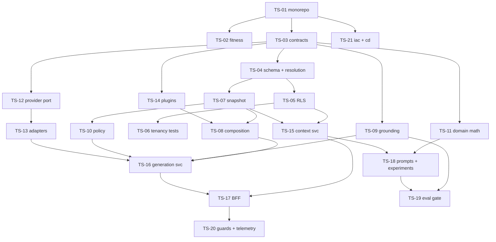

# Technical backlog

21 stories, written from the technical standpoint. Each is a vertical or infrastructural slice with its
own acceptance criteria and its own harness prompt. Story ids are stable — use them in commit messages
(`feat(TS-09): ...`) and in `docs/workflow/<TS-id>/`.

Derived from `01-SYSTEM-DESIGN.md` and the prototypes. Where a story and a prototype disagree, the
prototype wins.

## Index

| id | Title | Scope | TDD | Depends on |
|---|---|---|---|---|
| [TS-01](TS-01-monorepo-and-verify-gate.md) | Monorepo, strict TypeScript, one verify gate | infra | — | — |
| [TS-02](TS-02-architectural-fitness-functions.md) | Architectural fitness functions | infra | — | TS-01 |
| [TS-03](TS-03-contracts-package.md) | Contracts package from the prototype fixtures | contracts | — | TS-01 |
| [TS-04](TS-04-three-scope-schema-and-resolution.md) | Three-scope schema + effective-config resolution | data + domain | **yes** | TS-03 |
| [TS-05](TS-05-rls-and-tenant-context-client.md) | RLS policies + tenant-context client | data | — | TS-04 |
| [TS-06](TS-06-tenancy-invariant-tests.md) | Tenancy invariant test suite | data | **yes** | TS-05 |
| [TS-07](TS-07-config-snapshot-and-versioning.md) | Config snapshot assembly + versioning | domain | **yes** | TS-04 |
| [TS-08](TS-08-prompt-composition.md) | Prompt composition | domain | **yes** | TS-07, TS-14 |
| [TS-09](TS-09-grounding-guard.md) | Grounding guard — seven actions | domain | **yes** | TS-03 |
| [TS-10](TS-10-policy-engine.md) | Policy engine | domain | **yes** | TS-07 |
| [TS-11](TS-11-domain-math.md) | Bucketing, cost accounting, edit distance | domain | **yes** | TS-03 |
| [TS-12](TS-12-provider-port-and-fake.md) | Provider port + FakeProvider | llm | **yes** | TS-03 |
| [TS-13](TS-13-real-adapters-and-resilience.md) | Real adapters, contract suite, resilience | llm | — | TS-12 |
| [TS-14](TS-14-style-plugin-system.md) | Style manifest system + contract test kit | plugins | **yes** | TS-03 |
| [TS-15](TS-15-context-service.md) | Context Service — control plane | service | — | TS-05, TS-07 |
| [TS-16](TS-16-generation-service.md) | Generation Service — execution plane, streaming | service | — | TS-08…TS-13 |
| [TS-17](TS-17-bff-and-entry-link.md) | BFF: link resolution, orchestration, outcome capture | service | **yes** | TS-15, TS-16 |
| [TS-18](TS-18-prompt-versioning-and-experiments.md) | Prompt versioning + experiments | quality | **yes** | TS-11, TS-15 |
| [TS-19](TS-19-golden-set-eval-gate.md) | Golden-set evaluation gate | quality | — | TS-09, TS-18 |
| [TS-20](TS-20-guards-and-observability.md) | Budget guard, rate limiting, observability | ops | **yes** | TS-17 |
| [TS-21](TS-21-iac-cicd-and-rollback.md) | IaC, CI/CD via OIDC, rollback drill | ops | — | TS-01 |

## Dependency graph



## Sequencing against the four-day plan

| Day | Stories | Ends with |
|---|---|---|
| **1** | TS-01, TS-02, TS-03, TS-21, then the thin path through TS-12 + TS-08 + TS-16 + TS-17 | a public URL producing a draft from the fake provider |
| **2** | TS-04, TS-05, TS-06, TS-07, TS-13, TS-14, TS-09, TS-10 | two structurally different tenants, real providers, plugins, grounding enforced |
| **3** | TS-11, TS-15 hardening, TS-18, TS-19, console screens | a live A/B with acceptance and edit-distance data |
| **4 AM** | TS-20, TS-02 violation drill, TS-21 rollback drill | budget 429, telemetry, a recorded rollback |
| **4 PM** | — | `SPEC.md`, `REVIEW.md`, diagram, demo script. Protected. |

**Day 1 is deliberately shaped so TS-21 lands early.** Deploying on day 4 is the most common way this
assignment fails.

## Per-story workflow

```
/decision-mapping   only when the story carries an architectural choice → ADR
/tdd                stories marked TDD: failing test committed first, three commits
/implement          the build
/review             self-review before you look at it
/qa                 verify against this story's acceptance criteria
```

Artifacts land in `docs/workflow/<TS-id>/`. Then run the Codex adversarial prompt
(`02-ARCHITECTURE-DIALOGUE.md` §5) and commit its output with your accept/reject reasoning.

## Definition of done, every story

```
[ ] pnpm verify green (lint · typecheck · dependency-cruiser · unit · integration · build)
[ ] Acceptance criteria all exercised, not assumed
[ ] TDD stories show three commits: test(TS-nn) → feat(TS-nn) → refactor(TS-nn)
[ ] docs/workflow/<TS-id>/ contains plan, review, verify, review-adversarial
[ ] AGENTS.md updated if an invariant or convention changed
[ ] No new tenant-scoped table without an RLS policy (TS-06 enforces this)
```
